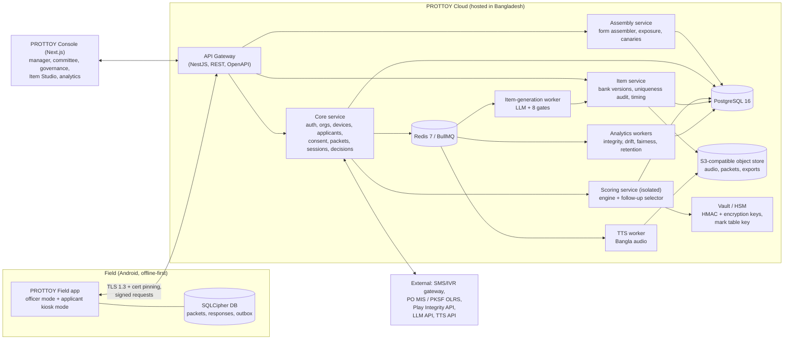
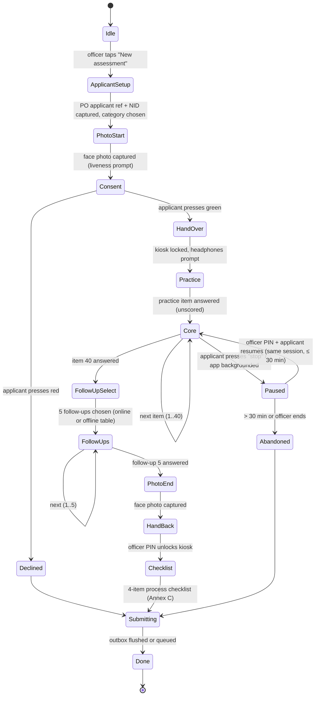

# PROTTOY — Master Build Specification for Cursor

**Product:** PROTTOY (প্রত্যয়) Psychometric Profiling Engine for first-time microfinance borrowers (PKSF and its Partner Organisations, Bangladesh)
**Spec version:** 1.0 · 25 September 2026 · matches research paper v3.0, Item Bank v3.0 and Scoring Key seed v0.3
**Owner:** Asif Hasan, Founder & CEO, Antarious AI
**Audience:** Cursor (AI coding agent) and the engineers supervising it

> **How Cursor must use this file.** This is the single source of truth. Read it fully before writing code. Build strictly in the milestone order of §21. Never skip a milestone's acceptance tests. When this spec and your instinct disagree, follow the spec. When the spec is silent, choose the most secure, most boring, best-documented option and record the decision in `docs/adr/`. Never invent psychometric logic: every formula you need is in §12 and in `reference/engine.ts`, which already passes all golden vectors with zero error.

---

## Table of contents

0. [The data pack that ships with this file](#0-the-data-pack-that-ships-with-this-file)
1. [What we are building](#1-what-we-are-building)
2. [Non-negotiable rules](#2-non-negotiable-rules)
3. [Glossary](#3-glossary)
4. [System architecture](#4-system-architecture)
5. [Fixed technology stack](#5-fixed-technology-stack)
6. [Monorepo layout](#6-monorepo-layout)
7. [Domain model: constructs, blueprint, items, pairs](#7-domain-model)
8. [Database schema (Prisma)](#8-database-schema-prisma)
9. [Security architecture](#9-security-architecture)
10. [Session lifecycle, packets and sync protocol](#10-session-lifecycle-packets-and-sync-protocol)
11. [Form assembler, exposure control and canaries](#11-form-assembler-exposure-control-and-canaries)
12. [Scoring engine PROTTOY-1000](#12-scoring-engine-prottoy-1000)
13. [Follow-up selector](#13-follow-up-selector)
14. [Decisions, bands, reason codes and deployment modes](#14-decisions-bands-reason-codes-and-deployment-modes)
15. [Mobile app specification](#15-mobile-app-specification)
16. [Web console specification](#16-web-console-specification)
17. [Item bank management, uniqueness audit and AI item generation](#17-item-bank-management-uniqueness-audit-and-ai-item-generation)
18. [Audio (Bangla TTS) pipeline](#18-audio-bangla-tts-pipeline)
19. [Integrity analytics, drift detection and back-checks](#19-integrity-analytics-drift-detection-and-back-checks)
20. [Privacy, PDPO 2025 compliance, fairness and model operations](#20-privacy-pdpo-2025-compliance-fairness-and-model-operations)
21. [Build plan: milestones and acceptance criteria](#21-build-plan-milestones-and-acceptance-criteria)
22. [Testing strategy](#22-testing-strategy)
23. [DevOps, environments, observability](#23-devops-environments-observability)
24. [Cursor rules files](#24-cursor-rules-files)
25. [Appendices: API catalogue, env vars, error codes, payloads](#25-appendices)

---

## 0. The data pack that ships with this file

Put the pack at the repo root as `./prottoy-pack/` **for the first import only**, then move `restricted/` out of the repo (see §9.3).

```
prottoy-pack/
├── PROTTOY_CURSOR_BUILD_SPEC.md          ← this file (also copy to docs/SPEC.md)
├── data/
│   └── item_bank_v3.json                 ← 2,608 items (60 sets × 40 + 4 × 52 follow-ups), Bangla + English, NO marks
├── restricted/                            ← SECRET. Never commit. Never ship to mobile.
│   ├── seed_keys_v0.3.json                ← all marks, weights, calibration and veracity parameters
│   └── reference_impl/                    ← JS generator + reference scorer used to produce the bank and the vectors
│       ├── bank3.js  score3.js  sim3.js  stats3.js
│       └── lexicon.js  frames_a.js  frames_b.js  frames_c.js
├── reference/
│   ├── engine.ts                          ← verified TypeScript port of scoring, follow-up selection, assembly (0 diff vs vectors)
│   └── golden.check.ts                    ← standalone checker (`PACK_DIR=./prottoy-pack/ npx tsx prottoy-pack/reference/golden.check.ts`)
└── test/
    └── golden_vectors_v3.json             ← 64 scoring cases, 12 assembly cases, 32 follow-up cases, PRNG + hash checks
```

### 0.1 `item_bank_v3.json` shape (verbatim contract)

```jsonc
{
  "version": "3.0.0",
  "constructs": [{ "c": "C1", "bn": "সততা", "en": "Integrity", "idx": "WI", "def": "…" }, …11],
  "categories": [{ "code": "JAG", "bn": "জাগরণ", "en": "Jagoron", "desc": "…" }, { "code": "AGR" }, { "code": "SUF" }, { "code": "BUN" }],
  "pairTypes": { "PP": "Principle-practice", "SO": "Self-other (projective)", "SE": "Stake escalation", "AB": "Attitude-behaviour", "MR": "Mirror (reverse-worded)", "TD": "Temporal (near vs far)" },
  "formats":   { "GR": "Graded scale", "SJ": "Situational judgement", "PJ": "Projective estimate", "CH": "Now-or-later choice", "FC": "Forced-choice tetrad", "TF": "True/false" },
  "blueprint": [{ "q": 1, "slot": "Q01", "kind": "pair", "pair": "P1", "side": "a", "construct": "C1", "format": "GR", "pairType": "PP" }, …40],
  "timingModel": { "leadSeconds": 1.5, "wordsPerSecond": 1.9, "pauseSecondsPerOption": 0.8,
                   "latencySeconds": { "GR": 5, "SJ": 6, "PJ": 5.5, "CH": 6, "FC": 7, "TF": 3.5 },
                   "fixed": { "consent": 45, "practice": 20, "transitions": 15 } },
  "tfLabels": { "fact": [["ঠিক","Right","ভুল","Wrong"], ["সত্যি","True","মিথ্যা","False"]],
                "self": [["হ্যাঁ","Yes","না","No"], ["মেলে","Fits me","মেলে না","Doesn't fit me"], ["এটা আমি","That's me","এটা আমি না","That's not me"], ["আমার বেলায় ঠিক","True of me","আমার বেলায় ঠিক না","Not true of me"]] },
  "banks": {
    "JAG": {
      "sets": [{ "setId": "JAG-01", "items": [ /* 40 BankItem, ordered Q01..Q40 */ ] }, …15],
      "followUps": [ /* 52 BankItem: 44 twins + 3 VIR + 2 ADM + 3 ATT */ ]
    }, "AGR": {…}, "SUF": {…}, "BUN": {…}
  }
}
```

`BankItem`:

```jsonc
{
  "id": "JAG-01-Q01",            // CAT-SET-SLOT (core) or CAT-Xnn (follow-up)
  "category": "JAG", "set": 1, "slot": "Q01", "q": 1, "extra": false,
  "construct": "C1",             // null for FC/ATT/VIR/ADM
  "role": "SCORED",              // SCORED | FC | ATT | VIR | ADM
  "format": "GR",                // GR | SJ | PJ | CH | FC | TF
  "pair": "P1", "side": "a", "pairType": "PP",   // null if not a paired item
  "naturalOrder": true,          // true = options must be displayed in the stored order (graded/projective/choice/TF)
  "shuffle": false,              // true = shuffle options per session (SJ and FC)
  "stem": { "bn": "হাটে পড়ে থাকা ৮০০ টাকা নিজের কাছে রেখে দেওয়া কতটা ঠিক?", "en": "How right is it to keep Tk 800 found lying at the market?" },
  "estSeconds": 24.4, "words": 28,
  "options": [ { "id": "o_4965739074", "bn": "একদম ঠিক না", "en": "Not right at all" }, … ]  // TF items use ids "affirm" / "deny"
}
```

Option IDs are opaque (`o_` + 10 hex of an HMAC). **Never derive meaning from option order or ID.** For `shuffle: true` items the stored order is already scrambled.

### 0.2 `seed_keys_v0.3.json` shape (RESTRICTED)

```jsonc
{
  "keyVersion": "v0.3-seed",
  "optionIdScheme": "o_ + first 10 hex of HMAC-SHA256(salt, itemId:canonicalIndex)", "optionIdSaltHex": "…",
  "categories": {
    "JAG": {
      "params": {
        "cons":  { "C1": { "alpha": 5.963, "beta": 0.573, "mu": 0.617 }, … "C11": {…} },
        "lamW":  { "C1": 0.242, "C2": 0.202, "C4": 0.125, "C5": 0.215, "C3": 0.078, "C11": 0.139 },
        "lamS":  { "C6": 0.2, "C7": 0.167, "C8": 0.102, "C9": 0.152, "C10": 0.145, "C3": 0.077, "C11": 0.156 },
        "pi": 0.611,
        "omega": { "PP": 1.207, "SO": 0.985, "SE": 1.045, "AB": 0.935, "MR": 1.328, "TD": 0 },
        "fc":    { "other": 0.389, "filler": 0.194 },
        "vi":    { "S1": 0.3, "S2": 0.2, "S3": 0.2, "S4": 0.2, "S5": 0.1, "S6": 0.15 },
        "doubt": 0.35,
        "thr":   { "s1": 0.2, "s1w": 0.3, "s3": 0.25, "s4": 0.15, "s5": 0.6, "pd": 0.4 },
        "lat":   { "zmin": -1.2, "kappa": 0.35, "rhoMin": 0.55 },
        "cap":   0.45
      },
      "items": {
        "JAG-01-Q01": { "w": 0.895, "marks": { "o_4965739074": 0.971, … }, "firstOptionId": "o_4965739074", "dir": 1 },
        "JAG-01-Q16": { "w": 0.823, "fc": { "o_9d8a3e8951": "C1", "o_68c24f7a2c": "C6", "o_a547a7bf84": "F", "o_d49e7cb7c9": "F" }, "fcKeyedA": "C1", "fcKeyedB": "C6" },
        "JAG-01-Q10": { "w": 1.02, "pass": "affirm" },      // ATT
        "JAG-01-Q15": { "w": 0.97, "flagIf": "affirm" },    // VIR
        "JAG-01-Q18": { "w": 1.01, "flagIf": "deny" }       // ADM
      }
    }, …
  }
}
```

### 0.3 Golden vectors

`test/golden_vectors_v3.json` contains:
- `prng.check`: first five outputs of `mulberry32(12345)`; `hash.check`: FNV-1a-32 of three strings.
- `scoring[64]`: `{ caseId, category, responses: [{itemId, optionId, latencySeconds, followUp}], expected: ScoreResult }`.
- `assembly[12]`: `{ category, seed, target, tolSeconds, expectedItemIds[40] }`.
- `followUps[32]`: `{ category, rngSeed, coreResponses[40], expectedFollowUpIds[5] }`.

**Acceptance rule:** your production engine must reproduce every float to ≤ 1e-9 absolute and every `PS`, `WI1000`, `SRI1000`, `flags`, item-ID list exactly. `reference/engine.ts` already achieves 0.0 difference; port it, do not rewrite it.

---

## 1. What we are building

PROTTOY is a **pre-disbursement psychometric assessment** administered on an Android device by a PO loan officer to a first-time applicant. The applicant answers **40 core questions + 5 AI-selected follow-up questions** by touch, hearing every question and option in Bangla audio. The server scores the answers into a **PROTTOY Score (0–1000)**, a **Willingness Index (WI)**, a **Self-Regulation Index (SRI)**, a **Veracity Index (VI)**, flags and reason codes. A branch manager or credit committee sees these in a web console **beside** the PO's own KYC and credit appraisal. A human always makes the decision.

**Purely psychometric.** PROTTOY never asks about or scores: identity documents, credit history, MF-CIB, existing loans, income, assets, numeracy, business/farming/loan know-how. It only checks that the person answering is the applicant.

### 1.1 Components to build

| # | Component | Users | Form factor |
|---|---|---|---|
| A | **PROTTOY Field** (mobile app) | Field officer (setup/hand-over) and applicant (answers) | Android phone/tablet, offline-first |
| B | **API gateway + core services** | All clients | NestJS on Node 22, PostgreSQL, Redis |
| C | **Scoring service** (isolated) | Internal only | NestJS microservice, the only reader of marks |
| D | **Vault** | Internal only | HashiCorp Vault (Transit + KV) or HSM-backed KMS |
| E | **PROTTOY Console** (web) | Branch manager, credit committee, PO admin, PKSF governance, psychometrician, item reviewer, auditor, back-check agent | Next.js |
| F | **Item Studio** (inside Console) | Psychometricians, reviewers, language editors | Next.js |
| G | **Workers** | Internal | BullMQ workers: TTS, item generation, analytics, drift, fairness, retention |
| H | **Engine package** | Scoring service + workers only | Pure TypeScript, zero runtime deps |

### 1.2 Scale assumptions (design targets)

- 200+ POs, ~17,000 branches, up to 50,000 officers/devices eventually; pilot: 3–5 POs, 60–150 branches.
- Peak 200,000 sessions/day nationally at scale; pilot ≤ 2,000/day.
- Session payload ≤ 40 KB JSON + ≤ 6 MB audio per packet (cached across packets).
- p95 API latency ≤ 300 ms (excluding scoring); scoring p95 ≤ 150 ms; follow-up selection p95 ≤ 250 ms end-to-end.
- Availability 99.5% (pilot), 99.9% (scale). Offline mode must let a branch run a full day with zero connectivity.

---

## 2. Non-negotiable rules

Cursor must enforce every rule below in code, tests and lint rules. A pull request that violates any of these is rejected.

1. **No keys on devices.** Marks, weights, calibration parameters, pair-type weights and the option-ID salt never reach the mobile app, the web client, logs, analytics, crash reports, or any database column in plaintext.
2. **No score on the device.** The mobile app never computes, receives or displays any score, band, index, VI, flag or "correct" answer. No feedback of any kind after an answer.
3. **Engine isolation.** `packages/engine` may be imported only by `apps/scoring` and `apps/workers`. An ESLint `no-restricted-imports` rule and a CI dependency-graph check enforce it. `apps/mobile` and `apps/console` must fail the build if they import it.
4. **Restricted data never committed.** `restricted/`, `*.keys.json`, `seed_keys_*.json` are in `.gitignore`, `.cursorignore` and a pre-commit secret scanner (gitleaks). CI fails if any file matches.
5. **Human decides.** No endpoint declines an applicant automatically. VI alone can never produce a decline. Every decision stores the human decider and, for overrides, a reason.
6. **Purely psychometric scope.** No new question may ask about knowledge, arithmetic, income, assets, credit history, religion, ethnicity, politics or gender roles (checked by the item-generation gates, §17).
7. **Deterministic, versioned scoring.** Every score record stores `engineVersion`, `keyVersion`, `bankVersion`, the exact inputs, and an HMAC-SHA256 signature. Re-scoring the stored inputs with the stored versions must reproduce the stored outputs bit-for-bit.
8. **Uniqueness.** No two items in the bank may share a stem; no two multi-option items may share an option list; no option wording may repeat within a set or an assembled form. The uniqueness audit (§17.2) runs in CI and on every bank change.
9. **Fixed form length and time.** Every session = 40 core + 5 follow-ups. Assembled forms must be within ±10 s of the category target reading time.
10. **Consent first.** No question is shown before recorded consent. Declining consent ends the session with no penalty record.
11. **Data localisation and PDPO 2025.** Personal data is stored and processed in Bangladesh. Only item text (never personal data) may leave the country (e.g., to a TTS or LLM API).
12. **Accessibility first.** Every question and option is audio-played; buttons ≥ 64 dp; replay always available; no time pressure shown.
13. **Bangla correctness.** All Bangla text is Unicode NFC, rendered with a bundled Bengali font; numbers shown in Bangla digits in applicant mode.
14. **No dark patterns, no coercion.** The app never suggests answers, never shows timers to the applicant, never blocks an applicant from stopping.

---

## 3. Glossary

| Term | Meaning |
|---|---|
| PO | Partner Organisation of PKSF (an NGO-MFI) |
| Category | Loan programme: **JAG** Jagoron, **AGR** Agrosor, **SUF** Sufolon, **BUN** Buniad |
| Construct | One of 11 psychological traits C1–C11 (§7.1) |
| Set | One of 15 fixed 40-item sets per category (e.g. `JAG-07`) |
| Form | The 40 items actually administered in one session, assembled from the 15 sets |
| Pair | Two slots (sides `a`, `b`) that probe the same disposition in different formats (P1–P15) |
| Follow-up | One of 5 extra items chosen after the core form from the 52-item follow-up bank |
| Packet | Encrypted, single-use bundle containing a form, follow-up candidates, audio references and an offline selection table |
| Mark | Hidden fractional value 0.000–1.000 of an option (1 = most protective) |
| PS | PROTTOY Score 0–1000 |
| WI / SRI | Willingness Index / Self-Regulation Index |
| VI | Veracity Index 0–1 (High ≥ 0.70, Medium 0.50–0.69, Low < 0.50) |
| PDI | Pair Discrepancy Index |
| Tetrad | Forced-choice item with 4 statements (2 keyed, 2 fillers) |
| Canary | Officer-unique, psychometrically equivalent surface variant used to trace leaks |
| Silent mode | Deployment mode where scores are computed but hidden from decision-makers |

---

## 4. System architecture



### 4.1 Service responsibilities

| Service | Owns | Never does |
|---|---|---|
| `core` | Users, RBAC, orgs/branches, devices, applicants (pseudonymised), consent, packets metadata, sessions, responses, decisions, audit log, notifications | Read marks; compute scores |
| `assembly` | Building forms per packet, exposure counters (Sympson–Hetter), enemy rule, canary insertion, offline selection tables | Read marks (it uses only a *discrepancy bucket* export produced by `scoring`, §10.6) |
| `scoring` | Loading keys from Vault into memory, running the engine, follow-up selection (online), producing signed score records and reason codes | Store keys on disk; log inputs with option IDs next to marks; expose marks via API |
| `items` | Importing bank versions, uniqueness audit, timing model, audio references, item lifecycle | Store marks |
| `workers` | TTS, LLM generation gates, analytics, drift, fairness, retention/erasure | Serve HTTP to the public |

All services are one NestJS monorepo app split by module, deployable as separate containers. `scoring` runs in its own container with its own DB role (`prottoy_scoring`) that alone may read `mark_entries`.

---

## 5. Fixed technology stack

Pin exact versions in `package.json` at the time of scaffolding (latest stable). Do not substitute.

| Layer | Choice | Notes |
|---|---|---|
| Language | TypeScript 5.x, `strict: true`, `noUncheckedIndexedAccess: true` | Everywhere |
| Package manager | pnpm workspaces + Turborepo | Node 22 LTS |
| Mobile | React Native (New Architecture) via **Expo SDK (latest)** with **development builds** (not Expo Go), Expo Router | Android only, `minSdkVersion 26`, `targetSdkVersion` latest required by Play |
| Mobile state | Zustand (UI state) + **XState v5** (session state machine) | |
| Mobile storage | `@op-engineering/op-sqlite` with **SQLCipher**; `expo-secure-store` (Android Keystore) for DB key and device key alias | |
| Mobile crypto | `react-native-quick-crypto` (AES-256-GCM, ECDH P-256, HKDF, SHA-256) + Android Keystore via a small custom Expo module for non-exportable signing key | |
| Mobile audio | `expo-audio` | Opus/AAC files cached per packet |
| Mobile camera | `react-native-vision-camera` | Start/end face photos |
| Mobile security | `expo-screen-capture` (FLAG_SECURE), custom Expo modules: `prottoy-kiosk` (startLockTask/immersive), `prottoy-integrity` (Play Integrity token) | |
| Mobile tests | Jest + React Native Testing Library; **Maestro** for E2E | |
| Backend | **NestJS 10+** (Fastify adapter), class-validator replaced by **zod** via `nestjs-zod` | |
| ORM / DB | **Prisma 7+** (driver adapter `@prisma/adapter-pg`, URL in `prisma.config.ts`) + **PostgreSQL 16** (row-level security for tenant isolation) | Schema in §8 is validated against Prisma 7 |
| Queue / cache | **Redis 7** + **BullMQ** | |
| Object storage | S3-compatible (MinIO in dev; Bangladesh-hosted object store in prod) | |
| Secrets / keys | **HashiCorp Vault** (Transit engine for HMAC/encrypt; KV v2 for config). Production: Vault with HSM auto-unseal | |
| Web console | **Next.js 15** App Router, Tailwind CSS, shadcn/ui, TanStack Query, Recharts, next-intl (bn/en) | |
| Auth | Own auth in `core`: Argon2id passwords + TOTP for console; officer PIN + device binding for mobile; short-lived JWT (10 min) + rotating refresh tokens | |
| Contracts | `packages/contracts`: zod schemas → OpenAPI 3.1 (via `zod-to-openapi`) → typed client for mobile and console | |
| LLM | Anthropic Claude API (model configurable via env; use the most capable available) with JSON-schema structured output | Item text only, never personal data |
| TTS | Azure AI Speech neural voices **bn-BD** (e.g. `bn-BD-NabanitaNeural`, `bn-BD-PradeepNeural`), behind a `TtsProvider` interface | Human voice-editor QA required |
| Face match | `FaceMatchProvider` interface; default implementation: on-server ONNX (InsightFace ArcFace) model | Used only for start/end same-person check |
| Observability | OpenTelemetry → Grafana (Tempo/Loki/Prometheus); Sentry self-hosted for crashes (PII scrubbing on) | |
| CI/CD | GitHub Actions; Docker; Kubernetes (k3s acceptable for pilot) via Helm; EAS Build for Android (or local Gradle) | |

---

## 6. Monorepo layout

```
prottoy/
├── apps/
│   ├── mobile/                 # Expo RN app "PROTTOY Field"
│   │   ├── app/                # Expo Router screens (§15)
│   │   ├── src/
│   │   │   ├── machines/       # XState session machine
│   │   │   ├── crypto/         # packet decrypt, request signing, key mgmt
│   │   │   ├── db/             # SQLCipher schema + DAO
│   │   │   ├── sync/           # outbox, retry, backoff
│   │   │   ├── audio/          # player, cache, preloading
│   │   │   ├── offline/        # offline follow-up selection (bucket table only)
│   │   │   ├── i18n/           # bn / en strings, Bangla digits
│   │   │   └── ui/             # AnswerButton, ReplayButton, ProgressDots…
│   │   └── modules/            # custom Expo modules: prottoy-kiosk, prottoy-integrity, prottoy-keystore
│   ├── api/                    # NestJS: core, assembly, items modules + gateway
│   ├── scoring/                # NestJS microservice (isolated)
│   ├── workers/                # BullMQ workers
│   └── console/                # Next.js web console + Item Studio
├── packages/
│   ├── engine/                 # PORT OF reference/engine.ts — scoring, selector, assembler, timing, uniqueness
│   ├── contracts/              # zod schemas, OpenAPI generation, generated clients
│   ├── db/                     # Prisma schema, migrations, seed scripts
│   ├── crypto/                 # shared server crypto helpers (HMAC signing, packet sealing)
│   ├── i18n/                   # shared Bangla/English strings, Bangla digit utils
│   └── config/                 # eslint, tsconfig, prettier presets
├── tools/
│   ├── import-bank/            # imports item_bank_v3.json → DB (items, options)
│   ├── import-keys/            # imports seed_keys → Vault + mark_entries (encrypted); run from a secure workstation
│   ├── golden/                 # runs golden vectors against packages/engine
│   └── uniqueness-audit/       # CLI used by CI
├── infra/                      # docker-compose.dev.yml, helm charts, vault policies, k8s manifests
├── docs/
│   ├── SPEC.md                 # this file
│   ├── adr/                    # architecture decision records
│   └── runbooks/
├── .cursor/rules/              # §24
├── .gitignore  .cursorignore  .gitleaks.toml
└── turbo.json  pnpm-workspace.yaml
```

---

## 7. Domain model

### 7.1 Constructs

| Code | Bangla | English | Index | Direction |
|---|---|---|---|---|
| C1 | সততা | Integrity | WI | higher = better |
| C2 | দায়বোধ | Obligation & promise-keeping | WI | higher = better |
| C3 | নিয়ন্ত্রণবোধ | Locus of control | WI + SRI | higher = better |
| C4 | সামাজিক দায়বদ্ধতা | Social accountability | WI | higher = better |
| C5 | ফাঁকির যুক্তি (বিপরীত) | Default rationalisation (reverse) | WI | scored so higher = less rationalisation |
| C6 | আত্মসংযম | Self-control | SRI | higher = better |
| C7 | টাকা নিয়ে মনোভাব | Money attitudes | SRI | higher = better |
| C8 | ধৈর্য | Patience | SRI | higher = better |
| C9 | লোভ ও ঝুঁকির টান (বিপরীত) | Lure & risk susceptibility (reverse) | SRI | scored so higher = less susceptible |
| C10 | সহনশীলতা | Resilience & coping | SRI | higher = better |
| C11 | ঋণ-মনোভাব | Debt attitude | WI + SRI | higher = better |

### 7.2 The 40-slot blueprint (identical for every set and category)

| Slot | Content | Format | Slot | Content | Format |
|---|---|---|---|---|---|
| Q01 | P1a C1 | GR | Q21 | P1b C1 | SJ |
| Q02 | P4a C2 | GR | Q22 | P2b C1 | PJ |
| Q03 | P6a C5 | GR | Q23 | Tetrad | FC |
| Q04 | P8a C6 | GR | Q24 | P6b C5 | SJ |
| Q05 | P12a C4 | GR | Q25 | Attention | TF |
| Q06 | P14a C8 (near) | CH | Q26 | P8b C6 | SJ |
| Q07 | P2a C1 | SJ | Q27 | P9b C7 | GR |
| Q08 | P13a C3 | GR | Q28 | P12b C4 | SJ |
| Q09 | P9a C7 | GR | Q29 | Tetrad | FC |
| Q10 | Attention | TF | Q30 | P14b C8 (far) | CH |
| Q11 | P3a C1 (small stake) | SJ | Q31 | P5b C2 (mirror) | GR |
| Q12 | P10a C9 | SJ | Q32 | P13b C3 | SJ |
| Q13 | P15a C10 | SJ | Q33 | Virtue claim | TF |
| Q14 | P11a C11 | SJ | Q34 | P3b C1 (large stake) | SJ |
| Q15 | Virtue claim | TF | Q35 | P10b C9 | GR |
| Q16 | Tetrad | FC | Q36 | P15b C10 | GR |
| Q17 | P5a C2 | SJ | Q37 | P11b C11 (mirror) | GR |
| Q18 | Candid admission | TF | Q38 | P7b C5 (mirror) | GR |
| Q19 | P4b C2 | SJ | Q39 | Candid admission | TF |
| Q20 | P7a C5 | GR | Q40 | Tetrad | FC |

Pairs: P1 C1 PP · P2 C1 SO · P3 C1 SE · P4 C2 AB · P5 C2 MR · P6 C5 PP · P7 C5 MR · P8 C6 AB · P9 C7 AB · P10 C9 PP · P11 C11 MR · P12 C4 AB · P13 C3 AB · P14 C8 TD · P15 C10 PP.
The data file `blueprint` is authoritative; this table is for humans.

### 7.3 Item roles and option semantics

| Role | Formats | Options | How it is used |
|---|---|---|---|
| SCORED | GR, SJ, PJ, CH | 4 (CH: 5), item-specific | Mark lookup → construct |
| FC | FC | 4 statements | Chosen statement credits its construct (§12) |
| ATT | TF | `affirm`/`deny` | Attention check; `pass` in keys |
| VIR | TF | `affirm`/`deny` | Virtue claim; `affirm` counts as impression management |
| ADM | TF | `affirm`/`deny` | Candid admission; `deny` counts as impression management |

**TF labels.** The words on TF buttons are **presentation only** and are re-assigned per form so the 6 TF items in a form use 6 different label pairs: ATT items cycle through `tfLabels.fact[0..1]`, VIR/ADM items through `tfLabels.self[0..3]`, in slot order. `affirm` is always the first button, `deny` the second.

### 7.4 What the mobile app is allowed to know about an item

Packets carry a **stripped item view**: `{ itemRef, format, naturalOrder, stem.bn, stem.en?, options[{optionRef, bn, en?}], audio{stem, options[]}, labels? }`. `itemRef`/`optionRef` are **per-packet opaque tokens** (random 96-bit, base64url) mapped back to real IDs only on the server. The app never receives `construct`, `role`, `pair`, `side`, `pairType`, `set`, real item IDs or real option IDs. English text is included only if the officer enabled "English gloss" for supervisors (off by default; never shown in applicant mode).

---

## 8. Database schema (Prisma)

Create `packages/db/prisma/schema.prisma`. The model below is the minimum; add indexes named in comments. All tables have `createdAt`, `updatedAt`. Use UUIDv7 primary keys (`@default(dbgenerated("uuidv7()"))` via extension or app-generated). Enable PostgreSQL row-level security (RLS) on every tenant table with policies keyed on `current_setting('prottoy.org_id')`.

```prisma
generator client {
  provider = "prisma-client-js"
}
datasource db {
  provider = "postgresql"   // Prisma 7+: the connection URL lives in prisma.config.ts (DATABASE_URL), client uses @prisma/adapter-pg
}

enum Role {
  FIELD_OFFICER
  BRANCH_MANAGER
  CREDIT_COMMITTEE
  PO_ADMIN
  PKSF_GOVERNANCE
  PSYCHOMETRICIAN
  ITEM_REVIEWER
  LANGUAGE_EDITOR
  AUDITOR
  BACKCHECK_AGENT
  SYS_ADMIN
}
enum Category {
  JAG
  AGR
  SUF
  BUN
}
enum DeploymentMode {
  RESEARCH_LOW_STAKES
  SILENT
  ADVISORY
}
enum SessionStatus {
  CREATED
  CONSENTED
  IN_PROGRESS
  CORE_DONE
  FOLLOWUPS_DONE
  SUBMITTED
  SCORED
  ABANDONED
  VOID
}
enum ItemStatus {
  DRAFT
  IN_REVIEW
  PILOT
  LIVE
  SUSPENDED
  RETIRED
}
enum DecisionOutcome {
  APPROVE
  APPROVE_SMALLER
  PROBE
  COMMITTEE
  RETEST
  DECLINE
}

model Organisation {
  id String @id
  name String
  pksfCode String @unique
  mode DeploymentMode @default(SILENT)
  branches Branch[]
  users User[]
}
model Branch {
  id String @id
  orgId String
  org Organisation @relation(fields:[orgId], references:[id])
  name String
  division String
  district String
  upazila String?
  geo Json?
  users User[]
  @@index([orgId])
}
model User {
  id String @id
  orgId String?
  branchId String?
  role Role
  name String
  phone String @unique
  email String? @unique
  passwordHash String?
  totpSecretEnc Bytes?
  pinHash String?
  active Boolean @default(true)
  lastLoginAt DateTime?
  org Organisation? @relation(fields:[orgId], references:[id])
  branch Branch? @relation(fields:[branchId], references:[id])
  devices Device[]
  @@index([orgId, role])
}
model Device {
  id String @id
  userId String
  user User @relation(fields:[userId], references:[id])
  publicKeyPem String   // P-256, from Android Keystore
  model String
  androidVersion String
  appVersion String
  integrityVerdict Json?
  lastIntegrityAt DateTime?
  revoked Boolean @default(false)
  @@index([userId])
}
model Applicant {                       // pseudonymous: no name, no NID number in clear
  id String @id
  orgId String
  branchId String
  poApplicantRef String   // PO's own application reference
  nidHash Bytes                        // HMAC-SHA256(Vault key "nid-pepper", normalised NID) — for duplicate/retest detection only
  gender String?
  ageBand String?
  literacySelf String?
  division String   // fairness monitoring only, never scored
  @@unique([orgId, poApplicantRef])
  @@index([nidHash])
}
model Consent {
  id String @id
  sessionId String @unique
  version String
  audioPlayedMs Int
  accepted Boolean
  acceptedAt DateTime?
  declineReason String?
  evidence Json
}
model BankVersion {  // e.g. "3.0.0"
  id String @id
  version String @unique
  importedAt DateTime
  checksum String
  status String
}
model Item {
  id String @id                        // e.g. "JAG-01-Q01" or "JAG-X01"
  bankVersionId String
  category Category
  setNo Int?
  slot String?
  q Int?
  isFollowUp Boolean
  construct String?
  role String
  format String
  pair String?
  side String?
  pairType String?
  naturalOrder Boolean
  shuffle Boolean
  stemBn String
  stemEn String
  words Int
  estSeconds Float
  status ItemStatus @default(LIVE)
  familyId String?
  canaryOf String?    // canary variants point at their parent
  options ItemOption[]
  audio Json?    // { stem: s3Key, options: { [optionId]: s3Key } }
  @@index([category, setNo, q])
  @@index([category, isFollowUp])
}
model ItemOption {
  id String @id
  itemId String
  item Item @relation(fields:[itemId], references:[id])
  position Int
  textBn String
  textEn String
  @@index([itemId])
}
model KeyVersion {
  id String @id
  version String @unique
  hmacKeyName String
  activatedAt DateTime?
  retiredAt DateTime?
  checksum String
}
model MarkEntry {                       // readable ONLY by DB role prottoy_scoring
  keyVersionId String
  lookup Bytes     // HMAC(K_v, itemId || '\u001f' || optionId)
  ciphertext Bytes                      // Vault Transit ciphertext of {"m":0.971} or {"fc":"C1"} etc.
  @@id([keyVersionId, lookup])
}
model ParamSet {  // encrypted params JSON
  id String @id
  keyVersionId String
  category Category
  ciphertext Bytes
  @@unique([keyVersionId, category])
}
model Packet {
  id String @id
  deviceId String
  officerId String
  category Category
  bankVersionId String
  keyVersionId String
  sealedAt DateTime
  expiresAt DateTime
  usedAt DateTime?
  voidedAt DateTime?
  formItemIds String[]
  followUpCandidateIds String[]
  tokenMap Bytes                        // encrypted map of per-packet opaque refs → real item/option IDs
  canaryItemIds String[]
  seconds Float
  assemblySeed Bytes
  selectionTable Bytes?  // encrypted offline bucket table
  @@index([officerId, usedAt])
  @@index([deviceId])
}
model Session {
  id String @id
  orgId String
  branchId String
  officerId String
  deviceId String
  applicantId String
  packetId String @unique
  category Category
  status SessionStatus
  mode DeploymentMode
  startedAt DateTime?
  coreDoneAt DateTime?
  submittedAt DateTime?
  followUpMode String?                  // ONLINE | OFFLINE_TABLE
  gps Json?
  photoStartKey String?
  photoEndKey String?
  faceMatchScore Float?
  processChecklist Json?
  officerIndependentView String?        // captured BEFORE the manager sees the recommendation
  @@index([orgId, branchId, submittedAt])
  @@index([officerId, submittedAt])
}
model Response {
  id String @id
  sessionId String
  itemId String
  optionId String
  followUp Boolean
  position Int
  shownAt DateTime
  answeredAt DateTime
  latencyMs Int
  audioReplays Int
  touchMeta Json?   // pressure/size/dwell for analytics
  @@unique([sessionId, itemId])
  @@index([itemId])
}
model ScoreRecord {
  id String @id
  sessionId String @unique
  engineVersion String
  keyVersion String
  bankVersion String
  ps Int
  wi1000 Int
  sri1000 Int
  vi Float
  viBand String
  band String
  flags String[]
  signals Json
  constructs Json   // shrunk construct scores
  reasonCodes String[]
  inputsDigest String
  signature String
  createdAt DateTime @default(now())
  visibleToDecisionMakers Boolean       // false in SILENT/RESEARCH modes
}
model Decision {
  id String @id
  sessionId String
  deciderId String
  outcome DecisionOutcome
  recommended DecisionOutcome?
  override Boolean
  overrideReason String?
  loanAmountBdt Int?
  notes String?
  decidedAt DateTime @default(now())
}
model ExposureCounter {
  itemId String
  branchId String
  month String
  shown Int @default(0)
  @@id([itemId, branchId, month])
}
model ExposureParam {  // Sympson–Hetter control parameter
  itemId String @id
  k Float @default(1.0)
}
model CanaryAssignment {
  id String @id
  officerId String
  month String
  itemId String
  parentItemId String
  @@index([officerId, month])
}
model IntegrityAlert {
  id String @id
  kind String
  subjectType String
  subjectId String
  severity String
  details Json
  status String @default("OPEN")
  @@index([kind, status])
}
model BackCheck {
  id String @id
  sessionId String
  agentId String?
  channel String
  scheduledFor DateTime
  result Json?
  status String
}
model AuditLog {  // hash chain
  id BigInt @id @default(autoincrement())
  at DateTime @default(now())
  actorId String?
  action String
  subject String
  details Json
  prevHash String
  hash String
}
model GenerationJob {
  id String @id
  itemModel String
  category Category
  status String
  params Json
  createdBy String
}
model CandidateItem {
  id String @id
  jobId String
  payload Json
  gateResults Json
  status String
  reviewerNotes Json?
}
model DriftStat {
  itemId String
  window String
  scope String   // "national" | "district:<id>" | "branch:<id>"
  protectiveRate Float
  medianLatencyMs Int
  cusum Float
  @@id([itemId, window, scope])
}
model FairnessReport {
  id String @id
  period String
  category Category
  metrics Json
  createdAt DateTime @default(now())
}
```

**Why `MarkEntry.lookup` is keyed.** A stolen DB dump cannot join marks to items without the Vault HMAC key, and the ciphertext cannot be read without the Vault Transit key.

---

## 9. Security architecture

### 9.1 Threat model (build controls for each)

| Actor | Attack | Required control |
|---|---|---|
| Applicant | Memorised leaked answers | 15-set pair-locked assembly; option shuffling; server-side keys; answer-dependent follow-ups; drift detection |
| Broker (dalal) | Coaches many applicants | Similarity clustering; S1/S4 signals; canaries |
| Officer | Leaks items, tells "best" option | No marks on device; FLAG_SECURE; canaries; officer analytics |
| Officer | Answers for the applicant | Kiosk hand-over; start/end face photos + match; touch-dynamics analytics; back-checks |
| Officer | Invents applicants | PO applicant reference + NID hash; GPS; SMS confirmation to applicant's phone; back-checks |
| Officer/manager | Probes scoring with trial answers | Scores only after sync, only for identity-bound sessions, rate limits, probing detector |
| Insider (tech) | Exfiltrates bank/keys | Vault + HSM; two-person rule; keyed mark lookups; audit hash chain; least-privilege DB roles |
| Device thief | Reads packets | SQLCipher with Keystore-wrapped key; packets AES-GCM with device-bound keys; remote wipe; 7-day packet expiry |
| Network attacker | MITM | TLS 1.3, certificate pinning (two pins incl. backup), request signing |

### 9.2 Key hierarchy

```
Vault (HSM-backed in prod)
├── transit/keys/prottoy-marks-<keyVersion>     AES-256-GCM96  encrypts MarkEntry.ciphertext & ParamSet.ciphertext
├── transit/keys/prottoy-marks-hmac-<keyVersion> HMAC-SHA256   derives MarkEntry.lookup
├── transit/keys/prottoy-score-sign             HMAC-SHA256    signs ScoreRecord
├── transit/keys/prottoy-packet-wrap            AES-256-GCM96  wraps per-packet data keys at rest on server
├── transit/keys/prottoy-nid-pepper             HMAC-SHA256    Applicant.nidHash
├── transit/keys/prottoy-audit-chain            HMAC-SHA256    AuditLog.hash
└── kv/prottoy/config                           non-key config (pins, feature flags)
```

- Vault policies: `scoring` may `encrypt/decrypt/hmac` only on `prottoy-marks-*` and `prottoy-score-sign`; `api` may use `prottoy-packet-wrap`, `prottoy-nid-pepper`, `prottoy-audit-chain`; nobody else touches mark keys. Two-person rule (Vault control groups) for key rotation and for reading `ParamSet`.
- **Device keys:** on first registration the app generates a **non-exportable P-256 key in Android Keystore** (StrongBox if available) via `prottoy-keystore`. Public key goes to `Device.publicKeyPem`. Used for (a) signing every request body (`X-Prottoy-Signature`), (b) ECDH to unwrap packet keys.

### 9.3 Handling the restricted pack

1. Run `tools/import-keys` **from a secure workstation**, never from CI: it reads `seed_keys_v0.3.json`, creates `KeyVersion v0.3-seed`, writes `MarkEntry` rows (HMAC lookup + Transit ciphertext) and `ParamSet` rows, prints a checksum, then **shreds the input file** (`shred -u`) after the operator confirms.
2. `restricted/reference_impl` is kept offline in an encrypted archive owned by the governance committee; it is not needed at runtime.
3. Dev/test environments use a **separate synthetic key version** `vDEV` generated by `tools/import-keys --synthetic` (random marks with the same structure) except for the golden-vector test job, which runs in an isolated CI runner with the real seed keys injected from an encrypted CI secret and **never** writes them to disk outside a tmpfs.

### 9.4 Request authentication and signing (mobile)

- Login: officer phone + PIN (6 digits, Argon2id hash server-side, 5 attempts → 30 min lock) + device binding. Returns access JWT (10 min, `aud=mobile`, claims: `sub`, `org`, `branch`, `device`, `role`) + refresh token (30 days, rotating, bound to device).
- Every mutating request carries `X-Prottoy-Device`, `X-Prottoy-Timestamp` (±120 s), `X-Prottoy-Nonce` (UUID, Redis replay cache 10 min) and `X-Prottoy-Signature = base64(ECDSA_P256(SHA256(method|path|timestamp|nonce|sha256(body))))`.
- **Play Integrity**: token requested at login and before every packet download; server verifies with Google; require `MEETS_DEVICE_INTEGRITY` and app recognised; failure → block packet download and raise `IntegrityAlert`.

### 9.5 Mobile hardening checklist

- `FLAG_SECURE` for the whole app (via `expo-screen-capture`).
- Kiosk: `startLockTask()` during applicant mode (screen pinning; device-owner lock task when PO devices are MDM-enrolled), immersive sticky mode, hardware back disabled; exiting requires officer PIN.
- Root/emulator/debugger/hook detection (Play Integrity + heuristic checks); refuse to decrypt packets if compromised.
- SQLCipher key: 256-bit random, wrapped by Keystore AES key; never in JS logs.
- Certificate pinning (OkHttp `CertificatePinner` via config plugin) with two SPKI pins.
- No `console.log` in release builds (Babel plugin strips); Sentry with `beforeSend` scrubber removing stems, options, applicant data.
- Remote wipe: server flag on `Device.revoked` → app wipes DB and keys on next contact.
- Packets expire 7 days after sealing; unused packets auto-deleted.

### 9.6 Server hardening checklist

TLS 1.3 only; HSTS; strict CORS for console origin; rate limits (per user, per device, per IP); CSP on console; Argon2id; TOTP mandatory for console roles; RBAC guard on every route (deny by default); RLS in Postgres; separate DB roles (`api`, `scoring`, `workers`, `readonly_analytics`); audit log hash chain verified nightly; secrets only from Vault; dependency scanning (Dependabot + `pnpm audit`); container image scanning (Trivy); SAST (Semgrep); annual penetration test; responsible disclosure page.

---

## 10. Session lifecycle, packets and sync protocol

### 10.1 Session state machine (implement in XState on mobile and as an enum-driven service on server)



Rules: the applicant can stop at any time (a visible "থামুন" stop button, always); abandonment is recorded, never penalised automatically; a session can be resumed once within 30 minutes; answers cannot be changed after moving to the next item (a "go back" would enable probing) **except** the practice item.

### 10.2 Packets

A **packet** = one future session's material, sealed for one device.

```jsonc
// Decrypted packet (in memory only on device)
{
  "packetId": "pk_…", "category": "SUF", "expiresAt": "2026-10-02T00:00:00Z",
  "bankVersion": "3.0.0", "consentVersion": "bn-1.2",
  "practice": { "itemRef": "…", "stemBn": "এখন কি দিনের বেলা?", "options": [ … ], "audio": { … } },
  "core": [ { "itemRef": "r_Zx…", "format": "SJ", "naturalOrder": false, "stemBn": "…", "options": [ { "optionRef": "r_…", "bn": "…" } ], "audio": { "stem": "a_…", "options": ["a_…"] } }, … 40 ],
  "followUpCandidates": [ /* the category's 52 follow-ups, same stripped shape */ ],
  "offlineSelection": { "salt": "…", "pairBuckets": { "<b64 hmac>": 0|1|2, … }, "pairMembers": [["r_a","r_b"], …15], "constructOfPair": [0..10], "twinsByConstruct": [[refs…], …11], "validityRefs": [ … ], "tieBreak": [ … 11 construct indexes ] }
}
```

- **Sealing (server, `assembly`):** build form (§11) → create per-packet random tokens for every item/option → pre-render/lookup audio keys → build offline selection table (§10.6) → serialise → encrypt with random 256-bit data key (AES-256-GCM, AAD = packetId|deviceId|category) → wrap data key with ECDH(device public key, ephemeral server key) + HKDF-SHA256 → store `tokenMap` encrypted with Vault `prottoy-packet-wrap`.
- **Downloading:** `POST /v1/packets/request { category, count ≤ 10 }` (Play Integrity token required). Server caps: ≤ 10 unused packets per device per category; ≤ 40 per officer per day.
- **Using:** a packet is bound to exactly one session; once `usedAt` is set it cannot be reused. Voided packets (abandoned before Q1) are discarded, not recycled.
- **Audio:** audio files are content-addressed (`sha256.opus`), downloaded once and cached in app storage (encrypted at rest with the DB key-derived file key). Packets reference audio by key.

### 10.3 Answer capture (device)

For every item the app records: `itemRef`, `optionRef`, `shownAt` (when stem audio started), `answeredAt` (tap up), `latencyMs = answeredAt − max(shownAt, audioEndAt)` (time after the last option finished playing; if the applicant answers during audio, latency is measured from `shownAt` and flagged `earlyAnswer=true`), `audioReplays`, optional `touchMeta` (pressure, contact size, dwell). Latency sent to the engine is `max(0.3, latencyMs/1000)` seconds.

Buttons accept a tap only after the stem audio has finished (options become enabled one by one as their audio plays; the replay button re-enables all). This enforces that every option was heard.

### 10.4 Outbox and sync

- All writes go to a local **outbox** table (`id, kind, payload, attempts, nextAttemptAt`) inside SQLCipher.
- Sync worker: exponential backoff (1 s → 30 min, jitter), runs on connectivity change, on app foreground and every 15 min via background task.
- Endpoint `POST /v1/sessions/{id}/submit` is **idempotent** (`Idempotency-Key` = session ID). Payload is encrypted to the server's public key (ECIES P-256 + AES-GCM) and signed by the device key.
- After server ACK (201 with `receiptHash`), the device deletes the packet, responses, photos and the outbox row. Keep only `{sessionId, submittedAt, receiptHash}` for 30 days for officer history (no answers, no score).

### 10.5 Online follow-up selection (preferred)

After item 40, if online: `POST /v1/sessions/{id}/followups { coreAnswers[40] }` → `core` forwards to `scoring` → `selectFollowUps` (§13) with a CSPRNG → returns 5 `itemRef`s from the packet's `followUpCandidates`. Timeout 4 s; on timeout or offline → offline selection.

### 10.6 Offline follow-up selection (fallback)

The device must not hold marks. The server therefore embeds a **coarse, salted discrepancy table** for this form only:

- For each pair `p` and each combination of option tokens `(oa, ob)`: `key = base64url(HMAC-SHA256(packetSalt, p | oa | ob))[:16]`, `value = bucket(|m_a − m_b|)` where bucket = 0 if ≤ 0.20, 1 if ≤ 0.45, 2 otherwise.
- `tieBreak`: a random permutation of the 11 constructs generated at sealing.
- Device algorithm: for each construct, `d = max bucket over its pairs`; rank constructs by `d` desc, then by `tieBreak`; for the top 4 take a **reverse-worded twin first** (the server lists `twinsByConstruct[c]` with reverse-worded twins first); choose the first twin not yet used; add one validity item chosen uniformly at random.
- Record `followUpMode = OFFLINE_TABLE`. The server scores whatever was asked; analytics compare online vs offline sessions.
- Residual risk (document in ADR): the table reveals which option *combinations* are consistent for this form, not which option is protective. Accepted, because packets are encrypted, single-use, integrity-gated and expire in 7 days.

### 10.7 Server-side processing on submit

1. Verify signature, device, packet binding, timestamps, nonce; decrypt; map tokens → real IDs via `tokenMap`.
2. Validate: exactly 40 core + (5 follow-ups or abandonment), each item from this packet, one answer per item.
3. Persist `Session`, `Response[]`, photos (to object storage, encrypted), checklist, GPS.
4. Enqueue `score-session` job → `scoring` service → `ScoreRecord` (§12) → reason codes and recommendation (§14).
5. Enqueue analytics jobs: exposure counters, drift stats, officer analytics, face match, back-check sampling, SMS confirmation to applicant phone (if provided) with fraud hotline.
6. Emit `session.scored` event → console notification (visibility depends on deployment mode).

---

## 11. Form assembler, exposure control and canaries

Implement in `packages/engine/src/assembly.ts` (pure logic) and `apps/api/src/assembly/` (DB access, exposure, canaries).

### 11.1 Timing model

```
itemSeconds(item) = 1.5 + item.words / 1.9 + 0.8 × item.options.length + LATENCY[item.format]
LATENCY = { GR: 5.0, SJ: 6.0, PJ: 5.5, CH: 6.0, FC: 7.0, TF: 3.5 }
words(text) = count of whitespace-separated tokens after replacing any of  ।?,.'‘’:;  with a space
target(category) = mean over the 15 sets of Σ itemSeconds(set items)          (≈ 924–939 s)
```

`item.words` is precomputed in the bank (stem + all options). After the pilot, replace `itemSeconds` by the item's measured median (`DriftStat`) when ≥ 200 observations exist; recompute targets per category monthly.

### 11.2 Algorithm (production)

```
assembleForm(category, branchId, officerId):
  sets = the 15 sets of the category (each 40 items, ordered Q01..Q40)
  rng  = CSPRNG (crypto.randomInt)             # test mode: mulberry32(seed) — must reproduce golden assembly vectors
  for attempt in 0..399:
    pairSet = {}
    form = []
    for qi in 0..39:
      slot = blueprint[qi]
      if slot.pair:
        if slot.pair not in pairSet: pairSet[slot.pair] = rng.int(0,14)     # both sides of a pair come from the same set
        cand = sets[pairSet[slot.pair]][qi]
      else:
        cand = sets[rng.int(0,14)][qi]
      form.append(cand)
    # production-only filters (skip in golden test mode):
    if any item.status != LIVE: continue
    if exposureReject(form, branchId): continue          # §11.3
    if enemyRuleViolated(form): continue                 # §11.4
    if |Σ itemSeconds(form) − target| > 10: continue
    if any option text (bn, NFC-normalised) repeats among non-TF items of the form: continue
    form = applyCanaries(form, officerId)                # §11.5
    return form
  raise AssemblyFailed  # alert; should never happen (≈1.7 draws per accepted form)
```

The deterministic core (`assembleForm(sets, R, target, tol)`) is already in `reference/engine.ts`; wrap it, do not change its draw order. In golden test mode `R = mulberry32(seed)` and the output must equal `expectedItemIds`.

### 11.3 Exposure control (Sympson–Hetter)

- Target maximum exposure `r_max = 0.15` per item per branch per calendar month (natural rate ≈ 1/15 = 0.067).
- Each item has control parameter `k_i ∈ (0,1]` (`ExposureParam`). When an item is drawn, accept it with probability `k_i`; if rejected, redraw that slot (for a pair, redraw the set for the pair).
- Nightly job recalibrates: `k_i ← clamp(k_i × r_max / observedRate_i, 0.05, 1)` using the last 30 days.
- Minimum exposure: if an item's monthly rate < 0.02 while its slot peers are ≥ 0.05, raise `k_i` to 1.

### 11.4 Enemy rule

Items carry `familyId` (frame family, e.g. `P1-f2` = "overpayment" scenario). Within a form, no two **non-pair-partner** items may share a family or a scenario tag (`tags[]` in Item Studio). Pair partners are allowed (they are intentionally parallel).

### 11.5 Canary variants

- For each officer and month, pick 2 random core slots; if a **canary variant** of the chosen item exists (`Item.canaryOf = parentId`, a surface variant differing in amount/place/wording but calibrated equivalent), substitute it and record `CanaryAssignment`.
- Canary items share the parent's keys (marks copied under the canary's option IDs) — generated by Item Studio "Create canary" (§17.5).
- If a canary's text is found outside (manual report or web monitoring), the officer is identified via `CanaryAssignment`.

### 11.6 TF label assignment

After assembly, label TF items in slot order: ATT items take `tfLabels.fact[i % 2]` for i = 0,1…; VIR/ADM items take `tfLabels.self[j % 4]`. `affirm` = first label, `deny` = second.

### 11.7 Option display order

For `shuffle: true` items (SJ, FC) shuffle options with the CSPRNG per session; record the displayed order in the response (`touchMeta.order`) for analytics. For `naturalOrder: true` items keep stored order.

---

## 12. Scoring engine PROTTOY-1000

`packages/engine/src/score.ts` = **exact port of `reference/engine.ts#score`**. The description below explains it; the code is authoritative. Every constant not in `params` is fixed:

```
LATENCY_NORM = { GR: 5.0, SJ: 6.0, PJ: 5.5, CH: 6.0, FC: 7.0, TF: 3.5 }   # seconds (seed; replace by pilot medians per format → keyVersion bump)
LOG_LATENCY_SD = 0.45 ; FAST_Z = −1.5 ; PRESENT_BIAS_FLAG = 0.45
W_SET = [C1, C2, C3, C4, C5, C11]   (summation order matters for bit-exactness)
S_SET = [C3, C6, C7, C8, C9, C10, C11]
```

### 12.1 The twelve stages

For each response r (in submission order; core first, then follow-ups):

1. **Keyed mark** — SCORED items: `m = marks[optionId]`. First-option flag: `first = naturalOrder && optionId == firstOptionId`.
2. **Latency weight** — `z = (ln τ − ln LATENCY_NORM[format]) / 0.45`; if `z < −1.5` then `fast++`; `ρ = clamp(1 − κ·max(0, z_min − z), ρ_min, 1)`.
3. **Item weight** — `w = key.w`.
   Validity items stop here: ATT → `attFail++` if `optionId ≠ pass`; VIR/ADM → `imN++`, and `im++` if `optionId == flagIf`.
4. **Tetrad credit** — FC: chosen statement's construct `ch`. If `ch == F` (filler): add `φ_f` to both keyed constructs A and B, record `keyed=false` once. Else add `1` to `ch` (record `keyed=true`) and `φ_o` to the other keyed construct.
   Accumulate per construct: `num += w·ρ·m`, `den += w·ρ`.
5. **Pair resolution** — for each core pair with both sides answered: if `|m_a − m_b| > δ` (`thr.pd`), reduce the higher side's contribution: `num_c −= w·ρ·(m_high − m_low)`. (Raw marks are kept for the veracity signals.)
6. **Construct score** — `r_c = num/den` (or `μ_c` if `den = 0`); `θ_c = 1 / (1 + e^(−α_c (r_c − β_c)))`.
7. **Veracity**
   - `PDI = Σ ω_type·|m_a − m_b| / Σ ω_type` over core pairs (TD weight 0).
   - `coreR_c` = mean raw mark of core, non-FC items of construct c; `D_twin` = mean `|m_followUp − coreR_c|` over scored follow-ups (if none, `D_twin = PDI`).
   - `IM = im / max(1, imN)`; `GR = mean mark of core GR items`; `FCk = keyed tetrads / tetrads`; `first = share of first-option answers among core GR+PJ items`; `fastShare = fast / responses`.
   - `S1 = clip(((1−s1w)·PDI + s1w·D_twin − s1) / 0.20)`; `S2 = clip(attFail / 2)`; `S3 = clip((IM − s3) / (0.75 − s3))`; `S4 = clip((GR − FCk − s4) / 0.35)`; `S5 = clip((first − s5) / (1 − s5))`; `S6 = clip((fastShare − 0.10) / 0.30)`.
   - `VI = 1 − min(1, Σ vi_k·S_k)`.
8. **Discounted shrinkage** — `μ'_c = μ_c·(1 − η·(1 − VI))`; `θ'_c = μ'_c + VI·(θ_c − μ'_c)`.
9. **Indices** — `WI = Σ_{c∈W_SET} λW_c θ'_c`; `SRI = Σ_{c∈S_SET} λS_c θ'_c`.
10. **Composite** — `G = WI^π · SRI^(1−π)`.
11. **Caps & flags** — if `attFail ≥ 2`: `G = min(G, cap)`, flag `RETEST`. If `presentBias = m(P14b) − m(P14a) > 0.45`: flag `PRESENT-BIAS` (information only).
12. **Scale & sign** — `PS = round(1000·G)`, `WI1000 = round(1000·WI)`, `SRI1000 = round(1000·SRI)`; `signature = HMAC-SHA256(Vault prottoy-score-sign, canonicalJSON({sessionId, engineVersion, keyVersion, bankVersion, inputsDigest, PS, WI1000, SRI1000, VI, flags}))`.

`inputsDigest = SHA-256(canonicalJSON(responses sorted by position))`. Canonical JSON = RFC 8785 (JCS).

### 12.2 Scoring service contract

```ts
// apps/scoring — internal gRPC/HTTP (mTLS), never exposed publicly
POST /internal/score        { sessionId, category, keyVersion, bankVersion, responses: Response[] } → ScoreResult & { signature, inputsDigest, reasonCodes, recommendation }
POST /internal/followups    { sessionId, category, keyVersion, coreResponses: Response[] }          → { followUpItemIds: string[5] }
POST /internal/pair-buckets { packetId, formItemIds, salt }                                          → { pairBuckets: Record<string,0|1|2> }   // for offline tables
GET  /internal/health
```

- Keys are loaded at startup from `MarkEntry`/`ParamSet` for the **active** and **previous** key versions, decrypted via Vault Transit, held in memory only, and never serialised. On `SIGHUP` or `key.rotated` event, reload.
- The scoring service logs only `sessionId`, versions, duration and result summary — never option IDs with marks.
- Re-score endpoint for audits: `POST /internal/rescore { scoreRecordId }` → must reproduce stored values exactly or raise `IntegrityAlert(RESCORE_MISMATCH)`.

### 12.3 Engine unit tests (must all pass before M3)

- Golden vectors: 64 scoring cases, 12 assembly cases, 32 follow-up cases, PRNG + hash checks — tolerance 1e-9 / exact.
- Property tests (fast-check): PS ∈ [0,1000]; VI ∈ [0,1]; an all-protective consistent response set never gets S1 > 0; two attention failures always cap `G ≤ cap`; permuting follow-up order changes nothing except float summation within 1e-12.
- Mutation guard: changing any single parameter by 1% changes at least one golden output (proves the test is sensitive).

---

## 13. Follow-up selector

Exact port of `reference/engine.ts#selectFollowUps`:

```
input: core answers (40), category follow-up bank (52, in bank order), keys, rng
byC[c]  = raw marks of core SCORED answers of construct c           (FC and TF excluded)
disc[c] = max over core pairs of construct c of |m_a − m_b|          (all pairs incl. P14)
s[c]    = mean(byC[c]) or 0.5 if none
ranked  = constructs C1..C11 stably sorted by (disc desc, s desc)
chosen  = []
for c in ranked while |chosen| < 4:
   pool = follow-ups with construct c (bank order), stably sorted by dir ascending if s[c] ≥ 0.6 (reverse-worded first) else descending
   chosen.push(pool[floor(rng() × min(2, |pool|))])
validity = follow-ups with role ATT|VIR|ADM (bank order)
chosen.push(validity[floor(rng() × |validity|)])
return chosen  # exactly 5
```

Production uses a CSPRNG; golden tests use `mulberry32(rngSeed)`. JavaScript `Array.prototype.sort` is stable (required).

---

## 14. Decisions, bands, reason codes and deployment modes

### 14.1 Bands (provisional; configurable per category in `ParamSet.bands`)

| PS band | Range | VI band | Range |
|---|---|---|---|
| A | ≥ 700 | High | ≥ 0.70 |
| B | 580–699 | Medium | 0.50–0.69 |
| C | 460–579 | Low | < 0.50 |
| D | < 460 | | |

### 14.2 Advisory matrix → `recommended`

| | VI High | VI Medium | VI Low |
|---|---|---|---|
| **A** | APPROVE (full amount) | APPROVE after 1 probe → `PROBE` | PROBE + home visit |
| **B** | APPROVE (standard) | PROBE | PROBE + back-check |
| **C** | APPROVE_SMALLER + graduation | COMMITTEE | COMMITTEE + back-check |
| **D** | DECLINE with reason (reapply 3 months) | RETEST once, then decide | RETEST + integrity review |

Overrides: `RETEST` flag → recommendation `RETEST` regardless of cell. **A decline recommendation is never produced when VI is Low** (the cell is RETEST). Buniad (`BUN`) uses an inclusion reading: `DECLINE` becomes `APPROVE_SMALLER` with support plan unless the committee decides otherwise.

### 14.3 Reason codes (max 4 per session, ordered by severity)

| Code | Trigger | Plain-language text (bn / en) for manager |
|---|---|---|
| `RC_PAIR_GAP_Cx` | a pair of construct x with raw gap > 0.40 | "একই বিষয়ে দুই ধরনের উত্তরে বড় পার্থক্য: {construct}" / "Large gap between principle and practice answers on {construct}" |
| `RC_LOW_Cx` | θ'_x among the 2 lowest and < μ_x − 0.10 | "{construct} তুলনামূলক দুর্বল" / "{construct} relatively weak" |
| `RC_IM` | S3 ≥ 0.5 | "নিজেকে অতিরিক্ত ভালোভাবে উপস্থাপনের প্রবণতা" / "Tendency to over-present oneself" |
| `RC_CHOICE_GAP` | S4 ≥ 0.5 | "নিজের বর্ণনা আর বাছাইয়ের মধ্যে অমিল" / "Self-description does not match choices" |
| `RC_ATTENTION` | S2 ≥ 0.5 | "মনোযোগ যাচাই প্রশ্নে ভুল" / "Attention checks failed" |
| `RC_STYLE` | S5 ≥ 0.5 | "একই ধরনের উত্তর বারবার" / "Repetitive answer pattern" |
| `RC_SPEED` | S6 ≥ 0.5 | "খুব দ্রুত উত্তর" / "Answers implausibly fast" |
| `RC_PRESENT_BIAS` | flag PRESENT-BIAS | "এখনকার টাকার প্রতি বেশি ঝোঁক" / "Strong preference for money now" |

Construct names come from §7.1. Reason codes never reveal item texts or marks.

### 14.4 Deployment modes (per Organisation, changeable only by `PKSF_GOVERNANCE` with two-person approval)

| Mode | Scores computed | Visible to managers/committee | Decisions recorded | Use |
|---|---|---|---|---|
| `RESEARCH_LOW_STAKES` | yes | no | no | Phase 2 pilot; supports research arms (§20.5) |
| `SILENT` | yes | no | yes (PO decides as usual) | Phase 3 silent run with outcome linkage |
| `ADVISORY` | yes | yes | yes, with recommendation and override reasons | Phase 4+ |

In every mode the officer independent view (`Session.officerIndependentView`: "approve / unsure / concerns + note") is captured in the app **before** anyone sees a recommendation.

---

## 15. Mobile app specification (PROTTOY Field)

### 15.1 Principles

- **Two modes, one device.** *Officer mode* (setup, hand-over, checklist, sync) and *Applicant mode* (kiosk-locked, audio-first, no text entry, no navigation).
- **Offline-first.** Everything from login (cached credential for 7 days) to submission works without a network, given downloaded packets.
- **Audio-first, low-literacy.** Every stem and option is spoken; text is shown in large Bangla; each option has a simple pictogram (see §15.6).
- **Nothing to learn from the screen.** No scores, no "correct", no progress-by-construct, no item codes; progress shown only as dots (40 + 5).

### 15.2 Navigation map (Expo Router)

```
app/
├── (auth)/login.tsx                 officer phone + PIN; device registration on first run
├── (auth)/register-device.tsx       Keystore key generation, integrity check, PO/branch confirmation
├── (officer)/home.tsx               today: packets available per category, outbox status, "New assessment"
├── (officer)/packets.tsx            download / refresh packets (online), expiry list
├── (officer)/new/applicant.tsx      PO applicant ref, NID (camera OCR or manual), phone (optional), category, fairness fields (gender, age band, self-reported reading ability) — marked "not used for scoring"
├── (officer)/new/photo-start.tsx    face capture with liveness prompt (blink/turn), quality checks
├── (officer)/new/consent.tsx        plays consent audio (Annex D); green/red buttons are pressed BY THE APPLICANT
├── (officer)/new/handover.tsx       "Please give the device to the applicant" + headphones prompt → enters kiosk
├── (applicant)/practice.tsx         one unscored neutral question
├── (applicant)/item.tsx             generic question renderer for 40 + 5 items
├── (applicant)/transition.tsx       "আর মাত্র কয়েকটি প্রশ্ন" between core and follow-ups (no explanation of why)
├── (applicant)/photo-end.tsx        second face capture
├── (applicant)/thanks.tsx           "ধন্যবাদ। যন্ত্রটি কর্মীকে ফেরত দিন।" → officer PIN to exit kiosk
├── (officer)/new/checklist.tsx      Annex C 4-item checklist + officer independent view (approve / unsure / concerns)
├── (officer)/new/submit.tsx         queued/submitted status, receipt
├── (officer)/history.tsx            last 30 days: session id, time, status (NO answers, NO scores)
├── (officer)/settings.tsx           language, audio volume test, sync, device info, logout
└── (officer)/pause.tsx              resume/abandon (PIN)
```

### 15.3 The question screen (`(applicant)/item.tsx`)

Layout (portrait, top → bottom):

1. Progress dots (small, grey; current = teal). No numbers.
2. Stem text in Bangla, 22 sp, max 3 lines, `NotoSansBengali-Medium`.
3. Big **replay** button (speaker icon, 64 dp) top-right.
4. Options: 2–5 full-width buttons, each ≥ 72 dp high, 16 dp gap, pictogram left, Bangla text 20 sp, high-contrast border. Colours: neutral only (no green/red semantics). Selected state: thick outline + haptic tick.
5. "Next" button appears only after an option is selected (applicant confirms). "থামুন" (stop) button bottom-left, small, always visible.

Audio behaviour: on mount play stem → then each option in display order with 0.8 s gaps, highlighting the option being read; buttons enable progressively as their audio completes. Replay restarts from the stem. A 10-second idle after audio triggers a gentle re-prompt audio ("যেটা আপনার সাথে মেলে সেটা চাপুন"). No countdowns.

Accessibility: TalkBack labels (Bangla); font scaling up to 130% without truncation (buttons grow); minimum contrast 4.5:1; left-handed layout toggle in settings.

### 15.4 Session machine (XState v5) — key events and guards

```ts
events: NEW, APPLICANT_OK, PHOTO_OK, CONSENT_YES, CONSENT_NO, HANDOVER_DONE, PRACTICE_DONE, ANSWER(optionRef), NEXT, CORE_COMPLETE,
        FOLLOWUPS_READY(refs), STOP, RESUME(pin), ABANDON(pin), PHOTO_END_OK, UNLOCK(pin), CHECKLIST_OK, SUBMITTED, APP_BACKGROUND
guards: packetValid, consentRecorded, allAudioHeard, officerPinValid, withinResumeWindow
actions: persistAnswer (SQLCipher, synchronous before NEXT), startLockTask, stopLockTask, requestFollowUpsOnlineOrOffline, enqueueSubmit, wipeSessionData
```

Every state transition is persisted so a crash/restart resumes exactly (re-lock kiosk, same item, audio restarts).

### 15.5 Local database (SQLCipher)

Tables: `officer_cache`, `packets(id, category, expiresAt, blobEnc, usedAt)`, `audio_index(key, path, sha256)`, `sessions(id, packetId, state, applicantRefHash, createdAt, …)`, `answers(sessionId, itemRef, optionRef, shownAt, answeredAt, latencyMs, replays, touchMeta)`, `photos(sessionId, kind, pathEnc)`, `outbox(id, kind, payloadEnc, attempts, nextAttemptAt)`, `receipts(sessionId, submittedAt, receiptHash)`. Migrations via versioned SQL files.

### 15.6 Pictograms for options

Graded items: a 4-step "filled jar" icon (full → empty) matched to option position **in natural order only**; do not imply which end is good (the jar is neutral). Situational/tetrad options: a neutral numbered shape (circle, square, triangle, diamond) so position icons carry no meaning after shuffling. Now-or-later options: banknote stacks sized by amount + calendar strip showing the delay. TF: ✓ / ✕ shapes in neutral grey (never green/red). All icons in `apps/mobile/assets/icons/*.svg`, rendered via `react-native-svg`.

### 15.7 Bangla text and numbers

- Bundle `Noto Sans Bengali` (Regular/Medium/Bold). Test shaping of conjuncts on Android 8–14.
- `toBanglaDigits(n)` in `packages/i18n` (০–৯), grouping in Indian style (১,০০০; ১০,০০০; ১,০০,০০০). Item texts already contain Bangla digits.
- All strings NFC-normalised at build time (CI check).

### 15.8 Performance budgets

Cold start ≤ 2.5 s on a 3 GB RAM Android 10 device; item transition ≤ 150 ms; audio start ≤ 200 ms (preload next 2 items); packet decrypt ≤ 400 ms; app size ≤ 60 MB (audio downloaded separately).

### 15.9 Officer UX details

- Home shows a warning when fewer than 3 packets remain for any category.
- NID capture: OCR the NID number (on-device ML Kit text recognition) or manual entry; the number is hashed on device with a server-provided per-org salt **and** sent over TLS for server-side peppered hashing; the clear NID is never stored on device after hashing.
- Photo quality checks: face detected, eyes open, not blurred; three attempts then allow proceed with flag.
- Checklist (Annex C): P1 answered alone · P2 no broker present · P3 private setting/headphones · P4 practice understood; any "No" requires a short reason (voice note allowed, ≤ 30 s).
- Officer independent view: "আমার মতে: অনুমোদনযোগ্য / নিশ্চিত নই / উদ্বেগ আছে" + optional note. Captured before submission; immutable afterwards.

---

## 16. Web console specification (PROTTOY Console)

Next.js app at `apps/console`, bilingual (bn/en toggle), role-based navigation. All data via the typed API client from `packages/contracts`. Server-side rendering for lists; no score data cached in the browser beyond the session (React Query `gcTime` 5 min, no persistence).

### 16.1 Pages by role

| Page | Roles | Content |
|---|---|---|
| `/login` + TOTP | all console roles | Argon2id + TOTP; lockout; session 8 h idle 30 min |
| `/applications` | BRANCH_MANAGER, CREDIT_COMMITTEE | Queue of scored sessions (ADVISORY mode only): applicant ref, category, officer, date, status; filters |
| `/applications/[id]` | BRANCH_MANAGER, CREDIT_COMMITTEE | **Decision view**: officer independent view (shown first), PS gauge with band, WI and SRI bars, VI band chip + fired signals in plain words, reason codes, recommended action; PO's own KYC/credit result entered or pulled via integration (side-by-side, never merged); decision form (outcome, amount, notes; override reason required when outcome ≠ recommended); applicant explanation sheet (Bangla, printable) |
| `/sessions/[id]/integrity` | PO_ADMIN, AUDITOR | Session timeline, latency plot, face-match result, GPS, checklist, flags (no answers shown to PO_ADMIN; AUDITOR sees answers without marks) |
| `/officers` | PO_ADMIN, AUDITOR | Officer analytics (§19.2): funnel plots, similarity clusters, alerts |
| `/backchecks` | BACKCHECK_AGENT, AUDITOR | Assigned back-checks, IVR/phone scripts, result capture |
| `/governance` | PKSF_GOVERNANCE | Deployment mode per PO, key/bank version activation (two-person approval), thresholds, fairness tolerances |
| `/fairness` | PKSF_GOVERNANCE, PSYCHOMETRICIAN | Parity dashboards (§20.3) |
| `/models` | PSYCHOMETRICIAN | Key versions, calibration runs, population stability, champion/challenger |
| `/items` (Item Studio) | PSYCHOMETRICIAN, ITEM_REVIEWER, LANGUAGE_EDITOR | §17 |
| `/audit` | AUDITOR, SYS_ADMIN | Audit log search with hash-chain verification status |
| `/admin` | SYS_ADMIN, PO_ADMIN | Users, branches, devices (revoke/wipe), SMS templates |

### 16.2 Explanation sheet (right to explanation)

A one-page Bangla PDF generated server-side (Puppeteer or `@react-pdf/renderer`) for the applicant on request: the decision, the main reason codes in plain words, the right to request reconsideration, the complaint channel (PKSF hotline), and data rights (§20.1). Never includes scores, marks or item texts.

### 16.3 Visual design

Colour tokens: navy `#12355B`, teal `#1F7A8C`, amber `#E09F3E`, red `#B23A48` (only for integrity alerts), neutral greys. Typography: Inter + Noto Sans Bengali. Charts: Recharts. All charts have a table view for accessibility.

---

## 17. Item bank management, uniqueness audit and AI item generation

### 17.1 Import

`tools/import-bank --file prottoy-pack/data/item_bank_v3.json --version 3.0.0`:
1. Validate with the zod schema `BankFileSchema` (packages/contracts).
2. Check: 4 categories × 15 sets × 40 items; 52 follow-ups per category; every set matches the blueprint slot-by-slot (format, pair, side, construct, role); non-TF items have ≥ 4 options (CH = 5); TF items have exactly `affirm`/`deny`.
3. Run the uniqueness audit (§17.2) — abort on any violation.
4. NFC-normalise all strings; reject if normalisation changes anything (the source must already be NFC).
5. Insert `BankVersion`, `Item`, `ItemOption` in one transaction; compute and store SHA-256 checksum of the canonical file.
6. Enqueue TTS jobs for every stem and option (§18).

Then `tools/import-keys` (secure workstation) — see §9.3. A bank version can be **activated** only if a key version exists that covers every item/option of the bank (checked by `scoring` via `POST /internal/coverage`).

### 17.2 Uniqueness audit (CI + runtime)

`packages/engine/src/uniqueness.ts`:

```
normalise(s) = NFC(s).trim().replace(/\s+/g, " ")
R1 stems: all normalise(stem.bn) across the whole bank (all categories, core + follow-ups) are distinct
R2 option lists: for non-TF items, join(normalise(option.bn) for options in stored order, " / ") are distinct
R3 in-set options: within each set, all normalise(option.bn) across all 40 items are distinct (TF included)
R4 option count: non-TF ≥ 4; CH = 5; TF = 2
R5 assembled forms: enforced at assembly (§11.2)
```

The v3 bank passes: 2,608 unique stems; 2,216 unique option lists for 2,216 multi-option items; 0 in-set repeats. CI job `uniqueness-audit` fails the pipeline on any violation, and Item Studio blocks promotion of any candidate that would violate R1–R3.

### 17.3 Item lifecycle

`DRAFT → IN_REVIEW → PILOT (unscored F5 slot, ≥ 400 responses) → LIVE → SUSPENDED (drift) → RETIRED`. Only `LIVE` items enter forms. Promotion to LIVE requires: psychometrician approval, language-editor approval, a field-officer reviewer approval, calibration results attached, a key entry created in a **new key version** (keys are immutable per version).

### 17.4 AI Item Generation Engine (worker `generate-items`)

Inputs: an **item model** (from Item Studio): `{ category, slot (Q01–Q40 or follow-up), pair, side, construct, format, familyBrief, lexicon (category fillers), wordBudget, optionPattern, prohibited[], examples (2–3 existing LIVE items of the same slot, texts only) }`.

LLM call (Anthropic Messages API, JSON output validated by zod). System prompt (store in `apps/workers/src/generation/prompts/system.md`):

```
You write assessment items for PROTTOY, a psychometric screening used by Bangladeshi microfinance NGOs.
Write in plain spoken standard Bangla (চলিত ভাষা) for low-literacy rural adults, with an English gloss.
Hard rules:
- Measure ONLY the named psychological construct. Never test knowledge, arithmetic, business/farming skill, income, assets, credit history.
- No personal names, religion, festivals, ethnicity, politics, caste, gender roles, brand names, or real organisations.
- Stem 8–16 words; each option 2–6 words; exactly {n} options; the protective option must NOT be the longest and must not sound more "moral" than the others.
- Options are concrete behaviours or judgements tied to this situation, not generic agree/disagree.
- At least one option must mention a category-specific element from the lexicon.
- For a pair item you must return BOTH sides (a and b) describing the SAME act in the two required formats.
- Output JSON only, matching the schema. Include "rationale" (English, 1–2 sentences) and "intendedOrder" (protective → risky) for reviewers.
```

Gates (each writes `CandidateItem.gateResults[gate] = {pass, details}`); fail any → discard:

1. **Schema & budget:** zod parse; word counts; option count; predicted `itemSeconds` within ±1.5 s of the slot mean.
2. **Vocabulary & script:** only Bengali Unicode block + Bangla digits + allowed punctuation; ≥ 95% of tokens in the PROTTOY common-word list (`packages/i18n/wordlist.bn.txt`, ~3,000 words; unknown words listed for the editor).
3. **Prohibited content:** keyword + LLM classifier (second model call with a strict yes/no rubric) for the prohibited list and for knowledge/arithmetic content.
4. **Uniqueness & novelty:** R1–R3 against the whole bank + retired items + leaked-item registry; embedding cosine similarity (multilingual embedding model) < 0.85 to every existing stem.
5. **Desirability:** an independent LLM panel (3 calls, temperature 0.7) is shown the options shuffled and asked which option "a person wanting to look good" would pick; if the intended protective option is picked by ≥ 2/3 → reject as too obvious (for SJ/FC); for GR items require that the middle options are rated plausible.
6. **Human review:** psychometrician + Bangla language editor + field officer (three independent approvals in Item Studio, side-by-side with the slot's existing items).
7. **Cognitive pre-test:** recorded result upload (think-aloud notes from 3–5 respondents) — manual gate.
8. **Pilot & calibration:** served as unscored F5 until ≥ 400 responses; compute option endorsement, item–rest correlation, GRM parameters, DIF (§20.3), median time; psychometrician sets marks → new key version.

The generator never edits LIVE items and never scores anyone.

### 17.5 Item Studio (console `/items`)

- Browse by category/set/slot; side-by-side view of the 15 variants of a slot; pair view (a and b sides together).
- Candidate review queue with gate results and diff to nearest existing item.
- Canary creation: pick a LIVE item → generate a surface variant (same family, different amount/place) → run gates 1–4 → mark `canaryOf` → copy keys under new option IDs in the next key version.
- Exports: confidential DOCX/PDF of sets for the governance committee (texts only), and "print specimen" for cognitive testing.

---

## 18. Audio (Bangla TTS) pipeline

- `TtsProvider` interface: `synthesize({ text, voice, ssmlRate, format: 'ogg_opus_48k' }) → Buffer`.
- Default provider: Azure AI Speech, voices `bn-BD-NabanitaNeural` (primary) and `bn-BD-PradeepNeural` (alternate), rate −10% (slow, clear). Only item/option text is sent (no personal data).
- Every stem and option is synthesised separately; filenames = `sha256(voice|rate|NFC(text)).opus`; stored in object storage; loudness normalised to −16 LUFS (ffmpeg `loudnorm`).
- **Voice-editor QA** in Item Studio: listen, approve, or upload a human recording that replaces the TTS file for that text hash. An item cannot go LIVE until all its audio is approved.
- Dialect packs (phase 2): per-region alternative recordings keyed by `(textHash, dialect)`; the packet chooses the branch's dialect pack if complete, else standard.
- Consent script audio (Annex D) is a human recording, versioned (`consentVersion`).

---

## 19. Integrity analytics, drift detection and back-checks

Workers run nightly (and hourly for alerts) over `readonly_analytics` replicas.

### 19.1 Item drift (compromised-item detection)

For every LIVE item and branch/district/national windows (7 and 30 days): protective-option rate `p` (share of answers with mark ≥ 0.9 — computed inside `scoring`, which exports only rates, never marks) and median latency. Two-sided CUSUM on `p` vs the item's pilot baseline and one-sided CUSUM on latency decrease. Alert when CUSUM > h (h = 5 σ-units) → `IntegrityAlert(ITEM_DRIFT)`, auto-suspend at national level if both signals fire; assembly then excludes it.

Pair-level leak signal: if the protective rate rises on side a but not on side b of the same pair (difference > 0.2 over 200+ sessions), raise `PAIR_ASYMMETRY`.

### 19.2 Officer analytics

- Funnel plots per branch/category for each officer: mean PS, share VI Low, RETEST rate, median session duration, share of sessions with face mismatch, share of first-option answers, similarity index.
- Similarity: for each officer, mean pairwise agreement of answer vectors among their applicants on shared items; z-score vs branch peers; clusters (DBSCAN on answer vectors) across officers/villages → `COACHING_CLUSTER`.
- Touch dynamics: identical latency profiles or touch pressure signatures across different applicants of one officer → `SAME_HAND`.
- Probing detector: > 3 sessions with the same NID hash in 30 days, or unusual session volume → `PROBING`.
- Outcome feedback (when repayment data exist): score-adjusted 12-month bad rate per officer.

### 19.3 Back-checks

Sample 5% of sessions uniformly + 20% of sessions from officers with open alerts; schedule within 7 days; channel IVR or phone call by an independent agent; a **different short form** (10 items drawn from other sets, same constructs) + three verification questions (was the officer present while you answered? did anyone help? did anyone ask for money?). Results feed alerts and are stored in `BackCheck`.

### 19.4 Canary monitoring

Manual "report a leak" form in the console + optional web-monitoring job that searches configured public sources for canary strings. Any hit → identify officer → `IntegrityAlert(CANARY_HIT)` to PO_ADMIN and PKSF_GOVERNANCE.

---

## 20. Privacy, PDPO 2025 compliance, fairness and model operations

### 20.1 Data protection

- **Lawful basis and consent:** recorded audio consent (Annex D), consent version stored; explicit statement that a human decides and that the applicant may request reasons and reconsideration; right to refuse without penalty (standard appraisal path).
- **Data minimisation:** no name stored by PROTTOY; `poApplicantRef` + peppered NID hash; photos kept 90 days then deleted (only the face-match score and a hash remain); fairness fields only for monitoring.
- **Retention:** responses and scores 5 years after loan end (PO supplies loan-end date via integration), then de-identified (drop `applicantId` link, keep aggregate research data). Nightly `retention` worker enforces this and logs to the audit chain.
- **Data subject rights:** access (explanation sheet + copy of their answers without marks), correction of identity data, erasure where lawful, objection to automated processing (always satisfied: human decides) — request workflow in console `/admin/requests`.
- **Localisation:** DB, object storage and backups in Bangladesh. Cross-border calls limited to TTS/LLM with item text only.
- **DPIA:** keep `docs/dpia.md` updated each milestone; security incidents follow `docs/runbooks/breach.md` (notification timelines per the ordinance's rules as issued).

### 20.2 Protected attributes

Gender, age band, division, reading ability are collected **only** for fairness monitoring, stored in `Applicant`, and are **never** passed to the engine. Religion, ethnicity, caste, political views are never collected. A unit test asserts that `score()` receives no applicant fields.

### 20.3 Fairness monitoring (monthly job `fairness-report`)

Per category and group (gender, age band, division, reading ability):
- Item level: Mantel–Haenszel DIF (ETS classes A/B/C) and logistic-regression DIF for every LIVE item with ≥ 200 responses per group; class C → suspend + review.
- Score level: mean PS and VI band distribution; approval-rate ratio (≥ 0.8 required); when outcomes exist, true-positive-rate ratio and calibration-within-groups (Hosmer–Lemeshow by group).
- Veracity false positives: share VI Low by reading ability; if the low-literacy group's share is > 1.5× the others → alert (VI thresholds may need group-specific recalibration, decided by governance).
- Output: `FairnessReport` + console dashboard + PDF for the governance committee.

### 20.4 Model operations

- **Key versions** are immutable. Recalibration (every 6–12 months or on leak) → new key version via the psychometrics pipeline (`tools/calibrate`: GRM/IRT fits, logistic calibration of α/β, penalised regression for λ, cross-validated δ and ω, outcome = 12-month bad status). Activation requires two approvals + back-test report (Gini, KS, calibration, fairness) vs current version.
- **Population stability index** of PS monthly per category; PSI > 0.25 → alert.
- **Champion/challenger**: optional shadow scoring of a challenger key version on live sessions (never shown), compared monthly.

### 20.5 Research support (Phase 2 low-stakes pilot)

- Research arms configurable per session in `RESEARCH_LOW_STAKES` mode: `STANDARD` vs `INSTRUCTED_FAKING` (consent-covered instruction audio: "answer to look as good as possible") to validate S1/S4 (§13 of the paper).
- Retest sub-study: schedule a second session with a different form after 14 days for ~300 volunteers.
- Export for analysts: de-identified CSV/Parquet of responses (with option IDs) + separate encrypted marks export only to the psychometrics workstation.

---

## 21. Build plan: milestones and acceptance criteria

Work strictly in order. Each milestone ends with: all tests green in CI, ADRs written for any decision, `docs/CHANGELOG.md` updated, and a short demo script in `docs/demos/Mx.md`. **Do not start a milestone until the previous one's acceptance criteria pass.**

### M0 — Repository, tooling, guard-rails (day 1–3)
Tasks: pnpm + Turborepo monorepo (§6); shared tsconfig/eslint/prettier; `.gitignore`, `.cursorignore`, gitleaks pre-commit + CI; ESLint `no-restricted-imports` forbidding `@prottoy/engine` in `apps/mobile` and `apps/console`; dependency-cruiser rule for the same; GitHub Actions skeleton (lint, typecheck, test, build); `infra/docker-compose.dev.yml` with Postgres 16, Redis 7, MinIO, Vault (dev mode), Mailpit; `.cursor/rules` files (§24); copy this spec to `docs/SPEC.md`.
**Accept:** `pnpm i && pnpm lint && pnpm typecheck && pnpm test` green; a test commit containing `seed_keys_v0.3.json` is blocked by the hook and by CI; importing engine from mobile fails lint.

### M1 — Engine package (day 3–6)
Tasks: port `reference/engine.ts` into `packages/engine` (split into `score.ts`, `followups.ts`, `assembly.ts`, `timing.ts`, `prng.ts`, `uniqueness.ts`, `types.ts`); zod types in `packages/contracts`; `tools/golden` runner; property tests (§12.3); uniqueness audit CLI.
**Accept:** golden runner: 64/64 scoring (max abs diff ≤ 1e-9, integers exact), 12/12 assembly, 32/32 follow-ups, PRNG and hash checks pass; property and mutation tests pass; `uniqueness-audit` on `item_bank_v3.json` reports 0 violations; 100% line coverage in `packages/engine`.

### M2 — Database, auth, organisations, devices (day 6–12)
Tasks: Prisma schema (§8) + migrations + RLS policies; seed script (PKSF, 2 demo POs, branches, users per role); auth (officer PIN + device binding; console Argon2id + TOTP); JWT/refresh rotation; RBAC guard; request signing verification middleware; Play Integrity verification (mockable); audit log with hash chain; OpenAPI generation; typed client.
**Accept:** e2e API tests for login flows, lockout, refresh rotation, replay rejection (nonce), signature failure, RLS isolation between POs (a PO_ADMIN cannot read another PO's sessions even with a crafted query), audit chain verification job passes and detects tampering.

### M3 — Item bank import, keys, Vault, scoring service (day 12–20)
Tasks: `tools/import-bank`; `tools/import-keys` (+ `--synthetic`); Vault Transit keys and policies (§9.2); `MarkEntry`/`ParamSet` population; `apps/scoring` with `/internal/score`, `/internal/followups`, `/internal/pair-buckets`, `/internal/rescore`, `/internal/coverage`; key loading and rotation; score signing; reason codes and recommendation (§14).
**Accept:** importing v3 bank + seed keys in the isolated CI job, then scoring all 64 golden cases **through the HTTP service** reproduces the vectors; rescore reproduces stored records; DB role `api` cannot `SELECT` from `mark_entries` (test asserts permission error); no log line contains a mark (log-scrubber test).

### M4 — Assembly, packets, exposure, canaries (day 20–28)
Tasks: assembly service (§11) with CSPRNG, exposure (Sympson–Hetter), enemy rule, canary substitution, TF labelling, option shuffling; packet sealing/encryption with device ECDH; token maps; offline selection table; packet request/expiry endpoints.
**Accept:** 10,000 simulated assemblies per category: all within ±10 s of target, zero repeated option texts, pair sides always from the same set, exposure per item ≤ 15% in a simulated branch month; packets decrypt only with the bound device key; tampered packets fail GCM auth; token maps never expose real IDs in the packet.

### M5 — Mobile app shell and officer flows (day 28–40)
Tasks: Expo app with dev client; custom modules `prottoy-keystore`, `prottoy-kiosk`, `prottoy-integrity`; SQLCipher DB; login, device registration, packets screen, new-assessment flow up to consent; Bangla i18n; theming; FLAG_SECURE; certificate pinning; root detection; Sentry scrubbing.
**Accept:** Maestro flows for registration, login offline/online, packet download, applicant setup, photo capture, consent decline path; screenshots are blocked; the app refuses to run on an emulator/rooted device in release builds.

### M6 — Applicant mode, audio, offline, sync (day 40–54)
Tasks: kiosk hand-over; practice; item renderer (§15.3) with progressive audio enabling; follow-up selection online + offline fallback; photo end; hand-back; checklist and officer independent view; outbox + idempotent submission; crash-resume; wipe after ACK.
**Accept:** full Maestro run of 46 screens (practice + 40 + 5) offline, then sync on reconnect → server shows the session scored; kill the app at random points 50 times → always resumes at the right item with kiosk re-locked and no duplicate answers; average item transition ≤ 150 ms on the reference device; audio heard-gate enforced.

### M7 — Console: decisions and governance (day 54–66)
Tasks: console auth; applications queue; decision view with officer view first, bands, VI, reason codes, recommendation, override reasons; explanation sheet PDF; governance (modes, version activation with two-person approval); admin (users, devices, revoke/wipe); SILENT/RESEARCH visibility rules.
**Accept:** Playwright e2e: in SILENT mode no score is visible anywhere to managers (API returns 403 on score fields); in ADVISORY mode decisions require override reasons when differing; explanation PDF renders Bangla correctly (visual snapshot test).

### M8 — Integrity analytics, drift, back-checks (day 66–76)
Tasks: workers for exposure recalibration, drift CUSUM, pair asymmetry, officer analytics, similarity clusters, touch-dynamics, probing detector, back-check sampling and agent UI, canary hit workflow, SMS confirmation with hotline.
**Accept:** synthetic-data tests: an injected leaked item is detected within 150 sessions; an injected coaching cluster (30 identical-profile sessions for one officer) raises `COACHING_CLUSTER`; back-check sampling rates within ±1% of targets.

### M9 — Item Studio and AI generation (day 76–90)
Tasks: Item Studio pages (§17.5); generation job orchestration; gates 1–8; embeddings; desirability panel; reviewer workflow; canary creation; pilot serving in F5 slot (unscored); calibration hand-off export.
**Accept:** generating 20 candidates for 3 item models produces gate reports; any candidate violating uniqueness or prohibited content is auto-rejected (seeded negative tests); a promoted pilot item is served only as unscored F5 and never affects scores (test).

### M10 — TTS pipeline and audio QA (day 80–92, parallel with M9)
Tasks: `TtsProvider` + Azure implementation + mock; synthesis for the whole bank (≈ 11,600 clips), loudness normalisation, content addressing, voice-editor QA UI, human recording upload, packet audio references, dialect-pack structure.
**Accept:** all LIVE items have approved audio; missing audio blocks activation; average clip loudness −16 ± 1 LUFS.

### M11 — Fairness, privacy, model ops (day 92–100)
Tasks: fairness report job + dashboards; DIF; retention/erasure worker; data-subject request workflow; DPIA document; PSI monitor; champion/challenger shadow scoring; research arms (instructed faking, retest).
**Accept:** fairness report generated on synthetic data with known injected DIF (detected as class C); retention job de-identifies test records on schedule; research arm assignment is balanced (χ² test p > 0.05 over 1,000 sessions).

### M12 — Hardening and pilot readiness (day 100–115)
Tasks: load tests (k6: 200 sessions/min submit, 50 packet requests/s); chaos tests (Redis/Vault outage behaviour); security review (OWASP ASVS L2 checklist, MASVS L2 for mobile); penetration test fixes; backup/restore drill; runbooks; release pipeline (signed AAB, staged rollout); pilot configuration (3–5 POs, SILENT or RESEARCH mode).
**Accept:** p95 targets met (§1.2); restore from backup in < 1 h with verified audit chain; zero high/critical findings open; pilot checklist signed by PKSF governance.

---

## 22. Testing strategy

| Level | Tooling | Must cover |
|---|---|---|
| Unit | Vitest (packages, api), Jest (mobile) | Engine 100% lines; crypto helpers; reason codes; bands; TF labelling; timing |
| Golden | `tools/golden` (+ in CI isolated runner) | 64 + 12 + 32 vectors, exact |
| Property | fast-check | Engine invariants (§12.3); assembly invariants (§11) |
| Contract | zod + OpenAPI diff check | No breaking change without version bump |
| Integration | Testcontainers (Postgres, Redis, Vault, MinIO) | Import bank/keys, packet sealing, submission → scoring |
| E2E mobile | Maestro on emulator (debug build with integrity mock) + physical device farm for release | §21 M5/M6 flows, crash-resume, offline day |
| E2E console | Playwright | Decision, governance, visibility rules |
| Security | gitleaks, Semgrep, Trivy, OWASP ZAP baseline, MobSF | Every PR (fast set), nightly (full) |
| Load | k6 | §1.2 targets |
| Accessibility | axe (console), Android Accessibility Scanner (mobile) | No critical issues |
| Bangla rendering | Snapshot tests of 200 random items on Android 8, 10, 13, 14 | No broken conjuncts, no truncation |

Test data: never use real applicant data in non-production environments. Synthetic applicants from `tools/synth` (uses `sim3`-style profiles: ideal, honest, risky, faker, acquiescent, random, speeder).

---

## 23. DevOps, environments, observability

- **Environments:** `dev` (docker-compose, synthetic keys), `test/CI` (ephemeral, synthetic keys; isolated golden job with seed keys), `staging` (Bangladesh-hosted, synthetic keys, production-like), `prod` (Bangladesh-hosted, HSM-backed Vault, real keys).
- **Deploy:** Docker images per app, Helm charts, GitOps (Argo CD) or GitHub Actions deploy; database migrations run as a pre-deploy job with backward-compatible migrations only.
- **Mobile release:** signed Android App Bundle; internal testing track → closed testing (pilot devices) → production; for MDM-managed PO devices, managed Google Play private app. Versioning `major.minor.patch+build`; the API enforces a minimum app version.
- **Backups:** Postgres PITR (WAL archiving) + daily base backups encrypted; object storage versioning; Vault snapshots (encrypted, split custody); quarterly restore drills.
- **Observability:** OpenTelemetry traces across gateway → core → scoring; RED metrics per endpoint; business metrics (sessions/day, sync lag, packets remaining per branch, VI Low share, alert counts); log redaction middleware (drops stems/options/marks/NID); SLO alerts to on-call.
- **Runbooks** (`docs/runbooks/`): key rotation, suspected leak, device loss, breach notification, Vault unseal, scoring mismatch, drift auto-suspension review, restore.

---

## 24. Cursor rules files

Create these files verbatim.

`.cursor/rules/00-core.mdc`
```md
---
description: PROTTOY core rules (always apply)
alwaysApply: true
---
- The single source of truth is docs/SPEC.md. Read the relevant section before editing code.
- Never put marks, weights, calibration parameters, pair weights or option-ID salts in code, fixtures, logs, mobile or console apps. Use synthetic keys (vDEV) in tests except the isolated golden job.
- Never import @prottoy/engine outside apps/scoring and apps/workers.
- The mobile app must never compute, receive or display scores, bands, flags, VI or "correct" answers.
- Scoring logic must match reference/engine.ts exactly; do not "improve" formulas. Changes require a new engineVersion, updated golden vectors approved by the psychometrician, and an ADR.
- Every new endpoint: zod schema in packages/contracts, RBAC guard, audit log entry, rate limit, OpenAPI update, tests.
- All Bangla strings NFC; use packages/i18n helpers for digits and plurals.
- Prefer boring, well-documented libraries; record every non-trivial choice in docs/adr/.
- Write tests first for engine, crypto, assembly, sync and permissions.
```

`.cursor/rules/10-mobile.mdc`
```md
---
description: Mobile app rules
globs: apps/mobile/**
---
- Android only. Expo development build. No Expo Go assumptions.
- Applicant mode: no text input, no navigation except Next/Replay/Stop, kiosk locked, FLAG_SECURE on.
- Persist every answer to SQLCipher before advancing. Every state transition is persisted for crash-resume.
- Options enable only after their audio has played. No timers visible to the applicant. No colour semantics (no green/red) on answer buttons.
- Packets and photos are decrypted only in memory; wipe after server ACK.
- Never log stems, options, NID, photos or tokens. Release builds strip console.*.
```

`.cursor/rules/20-backend.mdc`
```md
---
description: Backend rules
globs: apps/api/**, apps/scoring/**, apps/workers/**, packages/db/**
---
- Deny-by-default RBAC; RLS on tenant tables; separate DB roles per service; only prottoy_scoring may read mark_entries and param_sets.
- Idempotency keys on submit endpoints; nonce + timestamp + ECDSA signature verification on mobile requests.
- Secrets only from Vault. Never read keys from env vars in production.
- Score records are immutable; corrections create new records referencing the old one.
- Workers must be idempotent and resumable (BullMQ job IDs = natural keys).
```

`.cursor/rules/30-items.mdc`
```md
---
description: Item bank and generation rules
globs: apps/workers/src/generation/**, apps/console/app/items/**, tools/import-bank/**
---
- Items measure psychology only. Reject knowledge, arithmetic, income, credit, religion, ethnicity, politics, gender-role content.
- Enforce uniqueness rules R1-R3 (SPEC §17.2) before any item is saved beyond DRAFT.
- LLM calls send item text only; never applicant data.
- LIVE items are immutable; changes create a new item and retire the old one.
```

`.cursorignore` (in addition to .gitignore): `prottoy-pack/restricted/`, `**/*keys*.json`, `**/.env*`, `infra/vault/data/`.

---

## 25. Appendices

### 25.1 Public API catalogue (v1)

| Method & path | Role | Purpose |
|---|---|---|
| `POST /v1/auth/officer/login` | — | phone + PIN + deviceId + integrity token → tokens |
| `POST /v1/auth/refresh` | any | rotate refresh token |
| `POST /v1/devices/register` | FIELD_OFFICER (first login) | register Keystore public key, model, app version |
| `POST /v1/auth/console/login` / `POST /v1/auth/console/totp` | console roles | password + TOTP |
| `GET /v1/me` | any | profile, org, branch, mode, app min version |
| `POST /v1/packets/request` | FIELD_OFFICER | `{category, count}` → sealed packets (+ audio keys list) |
| `GET /v1/audio/{key}` | FIELD_OFFICER | signed URL redirect for audio file |
| `POST /v1/sessions` | FIELD_OFFICER | create session bound to packet + applicant setup (idempotent) |
| `POST /v1/sessions/{id}/followups` | FIELD_OFFICER | core answers → 5 follow-up refs (online path) |
| `POST /v1/sessions/{id}/submit` | FIELD_OFFICER | encrypted signed submission (idempotent) → receipt |
| `GET /v1/applications` | BRANCH_MANAGER, CREDIT_COMMITTEE | queue (ADVISORY only) |
| `GET /v1/applications/{sessionId}` | same | decision view data |
| `POST /v1/applications/{sessionId}/decision` | same | record decision / override |
| `GET /v1/applications/{sessionId}/explanation.pdf` | same | applicant explanation sheet |
| `GET /v1/officers/analytics` | PO_ADMIN, AUDITOR | officer metrics |
| `GET/POST /v1/alerts` | PO_ADMIN, AUDITOR, PKSF_GOVERNANCE | integrity alerts |
| `GET/POST /v1/backchecks` | BACKCHECK_AGENT, AUDITOR | back-check workflow |
| `GET/POST /v1/items/*` | PSYCHOMETRICIAN, ITEM_REVIEWER, LANGUAGE_EDITOR | Item Studio |
| `POST /v1/governance/mode` · `POST /v1/governance/activate-version` | PKSF_GOVERNANCE (two-person) | modes, versions |
| `GET /v1/fairness/reports` | PKSF_GOVERNANCE, PSYCHOMETRICIAN | reports |
| `GET /v1/audit` | AUDITOR, SYS_ADMIN | audit search |
| `POST /v1/requests` | PO_ADMIN | data-subject requests |

### 25.2 Error codes

`AUTH_INVALID`, `AUTH_LOCKED`, `DEVICE_REVOKED`, `INTEGRITY_FAILED`, `SIGNATURE_INVALID`, `REPLAY_DETECTED`, `PACKET_EXPIRED`, `PACKET_USED`, `PACKET_QUOTA`, `SESSION_STATE`, `SUBMISSION_INVALID`, `ASSEMBLY_FAILED`, `KEY_COVERAGE_MISSING`, `RESCORE_MISMATCH`, `MODE_FORBIDDEN`, `TWO_PERSON_REQUIRED`, `RATE_LIMITED`, `APP_VERSION_TOO_OLD`. Mobile shows Bangla messages from `packages/i18n/errors.bn.json`; never shows internal details.

### 25.3 Environment variables (server)

`NODE_ENV`, `DATABASE_URL` (per-service role), `REDIS_URL`, `S3_ENDPOINT`, `S3_BUCKET_AUDIO`, `S3_BUCKET_PHOTOS`, `S3_BUCKET_EXPORTS`, `VAULT_ADDR`, `VAULT_ROLE_ID`, `VAULT_SECRET_ID_FILE`, `JWT_ISSUER`, `JWT_AUDIENCE_MOBILE`, `JWT_AUDIENCE_CONSOLE`, `PLAY_INTEGRITY_PROJECT_NUMBER`, `PLAY_INTEGRITY_SA_FILE`, `SMS_GATEWAY_URL`, `SMS_GATEWAY_TOKEN_FILE`, `LLM_API_KEY_FILE`, `LLM_MODEL`, `TTS_PROVIDER`, `AZURE_SPEECH_REGION`, `AZURE_SPEECH_KEY_FILE`, `FACE_MODEL_PATH`, `OTEL_EXPORTER_OTLP_ENDPOINT`, `SENTRY_DSN`, `APP_MIN_VERSION`, `ACTIVE_BANK_VERSION`, `ACTIVE_KEY_VERSION`. Secrets are *file paths* mounted from Vault Agent, never literal values.

### 25.4 Example payloads

Follow-up request (device → server; refs are packet tokens):
```json
{ "sessionId": "ses_01J…", "coreAnswers": [ { "itemRef": "r_Zx1…", "optionRef": "r_Q9…", "latencyMs": 4210, "replays": 0 } ] }
```
Follow-up response:
```json
{ "followUpRefs": ["r_A1…", "r_B2…", "r_C3…", "r_D4…", "r_E5…"], "mode": "ONLINE" }
```
Score record (server internal):
```json
{ "sessionId": "ses_01J…", "engineVersion": "3.0.0", "keyVersion": "v0.3-seed", "bankVersion": "3.0.0",
  "ps": 709, "wi1000": 713, "sri1000": 704, "vi": 0.951, "viBand": "HIGH", "band": "A",
  "flags": [], "signals": { "S1": 0, "S2": 0, "S3": 0.02, "S4": 0.16, "S5": 0, "S6": 0 },
  "reasonCodes": ["RC_LOW_C9"], "recommendation": "APPROVE", "inputsDigest": "…", "signature": "…" }
```

### 25.5 Fixed Bangla texts

- Practice item: stem "এখন কি দিনের বেলা?" options "হ্যাঁ, দিন" / "না, রাত" (unscored, not recorded for analytics except latency baseline).
- Transition: "আর মাত্র কয়েকটি প্রশ্ন বাকি।"
- Idle re-prompt: "যেটা আপনার সাথে সবচেয়ে বেশি মেলে, সেটা চাপুন।"
- Stop confirm: "আপনি কি থামতে চান? থামলে কোনো সমস্যা নেই।" [থামব] [চালিয়ে যাব]
- Thanks: "ধন্যবাদ। যন্ত্রটি কর্মীকে ফেরত দিন।"
- Consent script: use Annex D of the paper verbatim (six paragraphs; the duration sentence says "প্রায় বিশ মিনিট"), recorded by a human voice; version `bn-1.2`.

### 25.6 Definition of done (every PR)

- [ ] Relevant SPEC section re-read; behaviour matches.
- [ ] Types strict; no `any`; zod validation at every boundary.
- [ ] Tests added/updated; coverage thresholds met; golden job green when engine touched.
- [ ] No secrets, marks or personal data in code, fixtures or logs (gitleaks + log-scrubber tests).
- [ ] RBAC + audit log for new actions; RLS verified for new tables.
- [ ] Bangla strings NFC and reviewed; accessibility checked.
- [ ] ADR written for new decisions; CHANGELOG updated.

### 25.7 Open decisions for the product owner (build with defaults, flag in ADRs)

1. Final TTS voice and whether to replace TTS with human recordings for all items (default: TTS + human QA).
2. MDM enrolment of PO devices for full lock-task kiosk (default: screen pinning without MDM).
3. Hosting provider in Bangladesh and HSM model (default: Vault with software unseal in staging, HSM in prod).
4. Integration method with PO MIS / PKSF OLRS for loan-end dates and repayment outcomes (default: CSV import job + API adapter interface).
5. Band cut-offs and matrix cells (default: §14; to be recalibrated after the silent run).

*End of specification.*
